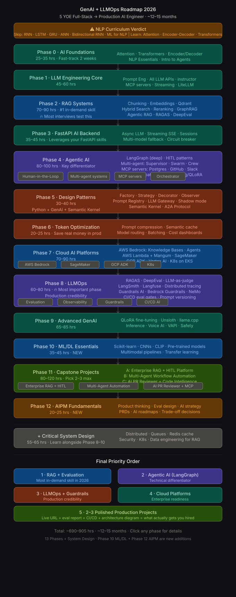

# 🚀 GenAI + Agentic AI + LLMOps Engineering Roadmap 2026
> **For:** 5 YOE Full-Stack Developer (React + Node + FastAPI)  
> **Goal:** Production AI Engineer / LLM Systems Engineer  
> **Strategy:** Real systems > theory. Build > Read. Ship > Plan.  
> **Timeline:** ~10–12 months at 2–3 hrs/day weekdays, 4–5 hrs weekends

---



## ⚡ Your Starting Advantage

| You Already Have | Implication |
|---|---|
| Python + FastAPI | Skip all beginner Python. Jump straight to AI-specific patterns. |
| REST APIs + Async | You understand the plumbing. Focus on LLM-specific behaviour. |
| React Frontend | Build AI UIs from day one. Skip frontend basics entirely. |
| Docker basics | Extend to multi-container AI deployments immediately. |
| RAG / LangChain / LangGraph exposure | Start from intermediate in those sections. |

**Start at Phase 0 — but fast-track it in 2 weeks, not 4.**

---

## 📊 Progress Tracker

```
[ ] Not started  |  [~] In progress  |  [x] Completed
```

| # | Phase | Focus | Est. Hours | Status |
|---|-------|-------|-----------|--------|
| 0 | AI Foundations | Attention, Transformers, NLP Essentials | 25–35 hrs | [x] |
| 1 | LLM Engineering Core | APIs, Prompting, Structured Outputs, MCP | 45–60 hrs | [ ] |
| 2 | RAG Systems | Chunking, Embeddings, Vector DBs, Eval | 70–90 hrs | [ ] |
| 3 | FastAPI AI Backend | Async, Streaming, Sessions, Multi-model | 35–45 hrs | [ ] |
| 4 | Agentic AI | LangGraph, HITL, Multi-agent, MCP, Orchestration | 80–100 hrs | [ ] |
| 5 | Design Patterns | Python GenAI patterns, Semantic Kernel, A2A | 30–40 hrs | [ ] |
| 6 | Token Optimization | Cost reduction, Semantic caching, Model routing | 20–25 hrs | [ ] |
| 7 | Cloud AI Platforms | Bedrock + Lambda + SageMaker + GCP ADK + K8s | 70–90 hrs | [ ] |
| 8 | LLMOps | Eval, Observability, CI/CD, Guardrails, Cost | 60–80 hrs | [ ] |
| 9 | Advanced GenAI | Fine-tuning, LoRA/QLoRA, llama.cpp, Inference, Voice | 65–85 hrs | [ ] |
| 10 | ML/DL Essentials for AI Engineers | Scikit-learn, CNNs, CLIP, Multimodal, Pre-trained models | 35–45 hrs | [ ] |
| 11 | Capstone Projects | 3 production-grade projects (Lambda, Cloud Run, CLIP) | 80–120 hrs | [ ] |
| 12 | AIPM Fundamentals | Product thinking, eval design, AI strategy, PRDs | 20–25 hrs | [ ] |
| + | Critical System Design | Distributed, Queues, Cache, Security, K8s | 55–65 hrs | [ ] |

**Total:** ~690–905 hrs → **~12–15 months** at recommended pace

---

## 🗓️ Monthly Timeline

```
Month 1   ──▶  Phase 0: AI Foundations (2 wks fast-track) + Phase 1: LLM Core (start)
Month 2   ──▶  Phase 1: LLM Core complete (APIs, MCP, Streaming)
Month 3   ──▶  Phase 2: RAG Systems Part 1 (Ingestion, Embeddings, Basic + Hybrid RAG)
Month 4   ──▶  Phase 2: RAG Systems Part 2 (Agentic RAG, GraphRAG, Evaluation)
Month 5   ──▶  Phase 3: FastAPI AI Backend + Phase 4: Agentic AI start (LangGraph)
Month 6   ──▶  Phase 4: Agentic AI complete (HITL, Multi-agent, MCP, Orchestration)
Month 7   ──▶  Phase 5: Design Patterns + Semantic Kernel + Phase 6: Token Optimization
Month 8   ──▶  Phase 7: Cloud Platforms (Bedrock + Lambda + SageMaker + GCP ADK + K8s)
Month 9   ──▶  Phase 8: LLMOps (Production hardening, Guardrails, CI/CD)
Month 10  ──▶  Phase 9: Advanced GenAI (Fine-tuning, llama.cpp, vLLM, Voice)
Month 11  ──▶  Phase 10: ML/DL Essentials (CLIP, CNNs, pre-trained models, multimodal projects)
Month 12+ ──▶  Phase 11: Capstone Projects (Lambda + Cloud Run + CLIP projects)
Month 13  ──▶  Phase 12: AIPM Fundamentals + Interview Prep
```

---

## 🧠 PHASE 0 — AI Foundations (Fast-Track: 2 Weeks)
> **25–35 hrs** | Goal: conceptual clarity. Move fast. Don't implement RNNs.

### 0.1 AI Landscape (3 hrs) `Basic`
- [ ] AI vs ML vs DL vs GenAI vs Agentic AI — clear mental model
- [ ] Traditional AI vs Generative AI — the fundamental paradigm shift
- [ ] LLM vs Multimodal systems — where each fits
- [ ] AI product lifecycle — prototype → evaluation → production → monitoring
- [ ] Where you fit as a full-stack dev in the AI engineering org

### 0.2 Attention Mechanism (4 hrs) `v.IMP 🔥`
- [ ] Why attention was invented — the problem with fixed-size context vectors
- [ ] Seq2Seq + Attention (Encoder-Decoder) — understand the pattern, not the LSTM code
- [ ] Self-attention — every token attends to every other token
- [ ] Scaled dot-product attention — the actual math: `softmax(QKᵀ / √d_k) · V`
- [ ] Multi-head attention — parallel attention over different representation subspaces
- [ ] Key insight: attention = parallelisable; RNNs = sequential. That's why Transformers won.

### 0.3 Transformers — CORE (10 hrs) `v.IMP 🔥`
- [ ] Full Transformer architecture — encoder stack + decoder stack
- [ ] Positional encoding — why token order must be explicitly injected
- [ ] Layer normalisation + residual connections — training stability
- [ ] **3 architecture families every engineer must know:**
  - [ ] **Encoder-only (BERT, RoBERTa)** → classification, embeddings, retrieval
  - [ ] **Decoder-only (GPT, Claude, Llama, Gemini)** → text generation — ALL major LLMs
  - [ ] **Encoder-decoder (T5, BART, Whisper)** → translation, summarisation, STT
- [ ] Context window — tokens, KV cache, why long context has cost implications
- [ ] Pre-training vs instruction fine-tuning vs RLHF — the 3-stage training pipeline
- [ ] What "hallucination" means at a technical level (not just "it makes things up")
- [ ] Resource: Karpathy — "Let's build GPT from scratch" (YouTube, 3h — essential)

### 0.4 NLP Essentials for GenAI (6 hrs) `v.IMP 🔥`
- [ ] Tokenization — BPE (Byte-Pair Encoding), WordPiece — why not just split by spaces
- [ ] Token counting — tiktoken, why cost = tokens not characters or words
- [ ] Embeddings — dense vectors, semantic geometry, what "closer = similar" really means
- [ ] Cosine similarity — how vector comparison drives RAG retrieval
- [ ] Sparse vs dense embeddings — BM25 keyword vs neural vector — both matter in RAG

### 0.5 Python Patterns for AI Systems (5 hrs) `Imp ⭐`
> You know Python. These are only the AI-specific patterns you'll use constantly.
- [ ] `async/await` in LLM apps — streaming pipelines, parallel API calls
- [ ] `asyncio.gather` — call 5 LLMs simultaneously without blocking
- [ ] `httpx` — async HTTP client, replaces `requests` for AI backends
- [ ] Pydantic v2 — `BaseModel`, validators, `model_validate`, nested schemas
- [ ] Generator functions — `yield` for streaming token-by-token pipelines
- [ ] Context managers — clean resource management for LLM clients

### 0.6 Intro to Agents (5 hrs) `v.IMP 🔥`
- [ ] Agent vs workflow vs pipeline — critical distinctions for architecture decisions
- [ ] Tool use — how LLMs "call" external functions via structured output
- [ ] ReAct loop — Reason → Act → Observe → repeat until done
- [ ] Memory taxonomy — in-context (short), external vector DB (long), procedural
- [ ] What makes agents fail — infinite loops, tool misuse, context overflow, hallucinated tool calls

**📦 Phase 0: No code project. Take structured notes. Push as markdown to GitHub.**

---

## 🔥 PHASE 1 — LLM Engineering Core (45–60 hrs)
> Your FastAPI + API integration background means you'll blaze through this.

### 1.1 Prompt Engineering (10 hrs) `v.IMP 🔥`
- [ ] Zero-shot — direct instruction, no examples
- [ ] Few-shot — in-context examples that define format and style
- [ ] Chain-of-Thought (CoT) — force step-by-step reasoning
- [ ] Tree-of-Thought (ToT) — explore multiple reasoning paths
- [ ] System prompts vs user messages vs assistant prefill
- [ ] Prompt templates — Jinja2-style, parameterised, version-controlled
- [ ] Guarded prompting — sanitise input, defend against injection
- [ ] Temperature, top-p, top-k, frequency/presence penalty — what they actually control
- [ ] Iterative prompt development — treat prompts like code: test → measure → improve
- [ ] Prompt injection attacks and defences — essential for production systems
- [ ] `max_tokens` budgeting — prevent runaway output costs

### 1.2 LLM Internals for Engineers (6 hrs) `Imp ⭐`
- [ ] Token cost anatomy — input vs output vs cached token pricing
- [ ] KV cache — what it is, why Claude/OpenAI charge less for cache hits
- [ ] Context window limits — 8K vs 128K vs 1M — practical engineering implications
- [ ] Sampling — greedy, top-k, nucleus (top-p), beam search — when to use each
- [ ] RLHF / RLAIF — conceptual understanding for interviews
- [ ] Model families — instruction-tuned vs base vs reasoning (o3/o4 style extended thinking)

### 1.3 Structured Generation (8 hrs) `v.IMP 🔥`
- [ ] JSON mode — force valid JSON output from LLMs
- [ ] OpenAI structured outputs — `response_format` with JSON schema enforcement
- [ ] Anthropic structured outputs — tool use as structured output trick
- [ ] **`instructor` library** — cleanest typed LLM output in Python
- [ ] Pydantic models — define schema, auto-validate LLM output, retry on failure
- [ ] Output parsers — gracefully handle malformed outputs with retry logic
- [ ] Streaming + structured output — handling partial JSON in stream

### 1.4 API Integration — All Major LLMs (12 hrs) `v.IMP 🔥`
- [ ] **OpenAI:** chat completions, embeddings, vision, function calling, streaming, batch API
- [ ] **Anthropic Claude:** messages, tool use, streaming, extended thinking, prompt caching
- [ ] **Google Gemini:** multimodal input, grounding, long context (1M tokens)
- [ ] **Groq:** ultra-fast inference for Llama, Mistral, Gemma
- [ ] **Ollama:** local model serving — Llama 3, Mistral, Phi-3, Gemma, Qwen
- [ ] **LiteLLM** — unified interface for all providers, `openai.ChatCompletion` style
- [ ] Error handling — rate limits, provider failures, exponential backoff, failover
- [ ] Token counting before sending — `tiktoken`, `anthropic.count_tokens`
- [ ] Async API clients — `AsyncOpenAI`, `AsyncAnthropic` for non-blocking calls
- [ ] Prompt caching — Anthropic cache breakpoints, OpenAI cached prompt discounts

### 1.5 MCP — Model Context Protocol (10 hrs) `v.IMP 🔥 ⭐ NEW 2026`
- [ ] What MCP is — standard protocol for AI ↔ tool/data integration (like REST but for AI)
- [ ] MCP architecture — client (AI), server (tool provider), transport (stdio or HTTP/SSE)
- [ ] **Build MCP Servers in Python:**
  - [ ] File system MCP server — read/write files as LLM-callable tools
  - [ ] Database MCP server — Postgres/SQLite exposed as query tools
  - [ ] REST API wrapper — wrap any internal API as MCP tools
  - [ ] Web scraping MCP server — fetch and parse web pages as tools
- [ ] MCP vs function calling — standard protocol vs ad-hoc per-provider schema
- [ ] Connecting MCP to Claude Desktop, Cursor, custom LangGraph agents
- [ ] MCP tool schema quality — description clarity directly affects LLM tool selection
- [ ] Authentication in MCP servers — API keys, OAuth2
- [ ] Error handling in MCP — timeouts, retries, graceful degradation
- [ ] Deploying MCP servers — Docker, Railway, AWS Lambda

### 1.6 Streaming Systems (6 hrs) `Imp ⭐`
- [ ] SSE (Server-Sent Events) — end-to-end from LLM API → FastAPI → React browser
- [ ] WebSockets — when to use over SSE (bidirectional real-time, agent step updates)
- [ ] FastAPI `StreamingResponse` — implementation patterns
- [ ] Token-by-token pipeline — buffer, flush, handle mid-stream errors
- [ ] Streaming with tool use — partial tool call chunks, assembly logic

### 🏗️ Phase 1 Projects

**Project 1A: Multi-Provider LLM Playground** (8 hrs)
- LiteLLM routing to OpenAI, Claude, Gemini, Groq
- Side-by-side comparison UI with latency + token cost display
- Prompt A/B testing with metric tracking
- Stack: FastAPI, LiteLLM, React, Docker

**Project 1B: AI Resume Analyser** (8 hrs)
- PDF/text resume + job description → structured JSON via `instructor` + Pydantic
- Skills extraction, match score, gap analysis, suggestions
- Streaming React UI
- Stack: FastAPI, OpenAI/Claude, instructor, Pydantic, React

**Project 1C: MCP Server — Postgres Query Tool** (8 hrs)
- MCP server exposing a Postgres DB schema + query execution
- Connect to Claude Desktop for natural language DB queries
- Tool schema design for table listing, schema inspection, safe SELECT queries
- Stack: Python MCP SDK, Postgres, Docker

---

## 📚 PHASE 2 — RAG Systems (70–90 hrs)
> RAG is the single most in-demand AI engineering skill in 2026. Master every layer.

### 2.1 Data Ingestion Pipelines (8 hrs) `v.IMP 🔥`
- [ ] Document loaders — PDF (PyMuPDF, pdfplumber), HTML, DOCX, CSV, JSON
- [ ] Unstructured.io — production-grade mixed-format parsing
- [ ] Handling tables, images, mixed content in PDFs
- [ ] Web crawling for RAG — playwright, sitemap-based crawl
- [ ] API data sources — pull REST APIs into vector DB on schedule
- [ ] ETL design — extract → clean → chunk → embed → store (each stage independently scalable)

### 2.2 Chunking Strategies (8 hrs) `v.IMP 🔥`
- [ ] Fixed-size chunking — simple baseline, loses semantic boundaries
- [ ] Sentence-level — NLTK, spaCy — preserves natural language units
- [ ] Recursive character splitting — LangChain default, good general baseline
- [ ] Semantic chunking — split on embedding-similarity drops (topic shifts)
- [ ] Parent-child chunking — small chunks for retrieval, parent for generation context
- [ ] Late chunking — embed full doc, pool to chunk-level (newer technique)
- [ ] Code-aware chunking — AST-based for code files
- [ ] Chunk overlap — why 10–20% overlap reduces boundary retrieval gaps
- [ ] Metadata enrichment — attach source, date, section, page to each chunk

### 2.3 Embeddings Deep Dive (10 hrs) `v.IMP 🔥`
- [ ] What embeddings represent — semantic space geometry
- [ ] **OpenAI:** `text-embedding-3-small` (cost-efficient), `text-embedding-3-large`
- [ ] **Open-source:** `nomic-embed-text`, `BGE-M3`, `E5-mistral-7b` (top performers)
- [ ] **Cohere:** `embed-multilingual-v3` — multilingual production use
- [ ] Embedding model tradeoffs — speed, cost, quality, dimensionality, language support
- [ ] Batch embedding — process 10,000 docs efficiently with rate limit handling
- [ ] Matryoshka embeddings — variable-dimension, truncate without quality loss
- [ ] Embedding freshness — when to re-embed after model version change

### 2.4 Vector Databases (12 hrs) `v.IMP 🔥`
- [ ] **ChromaDB** — local dev, easiest start, not for production scale
- [ ] **Qdrant** — production choice: named vectors, sparse+dense, payload filtering
- [ ] **Pinecone** — fully managed, serverless, metadata filtering
- [ ] **pgvector** — vector search inside Postgres (great if you already have Postgres)
- [ ] **FAISS** — in-memory, no server, good for batch processing pipelines
- [ ] **Weaviate** — multi-tenancy built-in, hybrid search native
- [ ] Indexing algorithms — HNSW (fast query) vs IVF (good for huge collections) vs Flat (exact)
- [ ] Metadata filtering — filter by user_id, date_range, source, category before vector search
- [ ] Multi-tenancy patterns — isolate collections per customer, namespace design
- [ ] pgvector for existing apps — add vector search to Postgres without a new DB

### 2.5 Advanced Retrieval (12 hrs) `v.IMP 🔥`
- [ ] **Hybrid search** — BM25 keyword + dense vector, best of both worlds
- [ ] **RRF (Reciprocal Rank Fusion)** — merge ranked lists from multiple retrievers
- [ ] **Reranking** — Cohere Rerank, `cross-encoder/ms-marco-MiniLM` (local reranker)
- [ ] **Query rewriting** — LLM rephrases query to improve retrieval recall
- [ ] **HyDE** — generate hypothetical answer, embed it, use as query vector
- [ ] **Multi-query retrieval** — generate N variants, union results, deduplicate
- [ ] **Context compression** — remove irrelevant sentences from retrieved chunks
- [ ] **Contextual retrieval** (Anthropic) — prepend document summary to each chunk before embedding
- [ ] **Step-back prompting** — abstract the question before retrieval

### 2.6 RAG Architectures (12 hrs) `v.IMP 🔥`
- [ ] **Naive RAG** — baseline: chunk → embed → retrieve → generate
- [ ] **Advanced RAG** — query rewriting + HyDE + hybrid + rerank
- [ ] **Modular RAG** — swap any component without rebuilding the whole pipeline
- [ ] **Agentic RAG:**
  - [ ] Self-correcting RAG — LLM judges retrieval quality, retries if insufficient
  - [ ] CRAG (Corrective RAG) — web search fallback when retrieval quality < threshold
  - [ ] Routing RAG — classify query, route to the appropriate knowledge collection
  - [ ] Adaptive RAG — decide: retrieve vs generate from memory vs search the web
- [ ] **GraphRAG** — Neo4j knowledge graph + LLM for multi-hop reasoning
- [ ] **Multi-hop RAG** — chain retrieval steps for complex comparative questions
- [ ] **Long-context RAG** — when to just stuff 128K context vs retrieve selectively

### 2.7 RAG Evaluation (10 hrs) `v.IMP 🔥`
- [ ] Why evaluation is as important as building — silent quality degradation kills trust
- [ ] **RAGAS:** faithfulness, answer relevancy, context precision, context recall
- [ ] **DeepEval:** modular metrics, custom assertions, LLM judge integration
- [ ] **TruLens:** RAG triad (answer relevance, context relevance, groundedness)
- [ ] LLM-as-judge — Claude / GPT-4o scoring outputs at scale
- [ ] Golden dataset construction — question + retrieved context + ground truth answer
- [ ] Regression suite — automated eval on every deploy, fail if score drops
- [ ] Target scores: faithfulness > 0.75, answer relevancy > 0.80

### 🏗️ Phase 2 Projects

**Project 2A: Basic RAG** (8 hrs)
- PDF → ChromaDB → GPT-4o answer with sources
- Baseline RAGAS score as benchmark for future comparison

**Project 2B: Production Hybrid RAG** (12 hrs)
- Qdrant BM25 + vector + Cohere rerank + parent-child chunking
- Contextual retrieval (Anthropic-style)
- RAGAS pipeline with target > 0.75 faithfulness
- FastAPI backend + React streaming chat UI

**Project 2C: Agentic RAG with Self-Correction** (15 hrs)
- Retrieval quality judge → retry or fall back to Tavily web search
- Multi-source routing — route query to different Qdrant collections
- Full eval: RAGAS + DeepEval with report
- Stack: LangGraph, Qdrant, Cohere, Tavily, FastAPI, Streamlit

**Project 2D: Multi-Tenant Enterprise Knowledge Base** (15 hrs)
- Isolated Qdrant collections per org/user
- Support PDF, DOCX, web URLs, REST API sources
- Async ingestion pipeline with real-time progress tracking
- Role-based access to different knowledge collections
- Stack: Qdrant, FastAPI, Celery + Redis, React

---

## ⚡ PHASE 3 — FastAPI AI Backend (35–45 hrs)
> You know FastAPI. Focus only on what changes when AI is in the loop.

### 3.1 AI-Specific API Design (6 hrs) `Imp ⭐`
- [ ] LLM-backed endpoint contracts — versioning when prompts change
- [ ] Idempotency for LLM requests — same input must not double-charge
- [ ] Webhook patterns for long-running LLM jobs (> 30 sec)
- [ ] Request/response schema evolution — backward compatibility with AI output changes

### 3.2 Async AI Systems (8 hrs) `v.IMP 🔥`
- [ ] Async LLM calls — never block the event loop during LLM I/O
- [ ] `asyncio.gather` — parallel LLM calls (fan-out pattern for multi-source retrieval)
- [ ] Background tasks — `BackgroundTasks` for async document ingestion
- [ ] Celery + Redis — heavy LLM batch jobs, document processing queues
- [ ] Job status polling API — long-running LLM task with progress updates

### 3.3 Streaming AI APIs (8 hrs) `v.IMP 🔥`
- [ ] `StreamingResponse` in FastAPI for LLM token streaming
- [ ] SSE pipeline: Anthropic/OpenAI stream → FastAPI → React (end-to-end)
- [ ] Streaming with tool use — handle partial tool call assembly
- [ ] Backpressure — client reads slower than LLM generates
- [ ] Mid-stream error recovery — graceful failure without broken UI

### 3.4 Production Backend Patterns (12 hrs) `v.IMP 🔥`
- [ ] Conversation session management — Redis-backed multi-turn chat history
- [ ] Context window management — trim old turns when context fills
- [ ] **Multi-model fallback:** GPT-4o → Claude → Gemini → Groq (via LiteLLM router)
- [ ] Circuit breaker — stop sending to failing LLM provider, auto-recover
- [ ] Request deduplication — prevent duplicate LLM charges on retries
- [ ] Cost tracking middleware — log input/output tokens per request, per user, per feature
- [ ] Rate limiting per user — `slowapi` + Redis sliding window
- [ ] Exact response cache — Redis cache for deterministic prompts (temperature=0)

### 🏗️ Phase 3 Project: Production AI API (15 hrs)
- LiteLLM multi-provider routing with fallback chain
- Streaming SSE endpoint
- Redis conversation sessions + context trimming
- Per-user rate limiting + cost tracking
- Circuit breaker for provider failures
- Docker + docker-compose

---

## 🤖 PHASE 4 — Agentic AI (80–100 hrs)
> Agents are what separate junior LLM app developers from senior AI engineers in 2026.

### 4.1 Core Agent Patterns (12 hrs) `v.IMP 🔥`
- [ ] **ReAct** — Thought → Action → Observation loop (foundational pattern)
- [ ] **Plan-and-Execute** — decompose into steps first, then execute (better for complex tasks)
- [ ] **Reflection** — agent critiques its own output, iterates until quality threshold met
- [ ] **Parallelisation** — run independent steps concurrently (fan-out)
- [ ] **Tool use design** — function schema quality directly affects agent reliability
- [ ] Agent vs workflow — agents decide the control flow; workflows have fixed paths

### 4.2 LangGraph — Primary Framework (20 hrs) `v.IMP 🔥`
**Fundamentals:**
- [ ] State — TypedDict or custom class, immutable at each step
- [ ] Nodes — pure Python functions that take state → return state update
- [ ] Edges — unconditional and conditional routing between nodes
- [ ] Cycles — enabling loops for retry, reflection, and multi-step agents
- [ ] `StateGraph` compilation and invocation

**Intermediate:**
- [ ] Checkpointing — `SqliteSaver`, `PostgresSaver` for resumable agents
- [ ] Interrupt / HITL — `interrupt_before`, `interrupt_after`, `NodeInterrupt`
- [ ] Subgraphs — composable agent modules, reusable across workflows
- [ ] Streaming — `stream` with `messages`, `updates`, `values` modes

**Advanced:**
- [ ] `Send` API — dynamic fan-out to parallel branches
- [ ] Map-reduce — process N items in parallel, aggregate results
- [ ] Long-running agents — state persisted across days/sessions
- [ ] LangGraph Platform — managed deployment, scheduling, webhook triggers

### 4.3 Human-in-the-Loop (HITL) (10 hrs) `v.IMP 🔥`
- [ ] Why HITL — agents make mistakes; some decisions require human authority
- [ ] **Interrupt patterns:**
  - [ ] `interrupt_before` — pause before node, human reviews input
  - [ ] `interrupt_after` — pause after node, human reviews output
  - [ ] Dynamic interrupt — agent itself decides it needs human input
- [ ] Approval workflows — agent proposes action → human approves/rejects/edits
- [ ] Correction flows — human edits output → agent continues with corrected state
- [ ] Escalation patterns — agent escalates when confidence < threshold
- [ ] HITL UI patterns — review queue, diff view, approve/reject buttons
- [ ] Async HITL — agent suspends, human reviews later, agent resumes
- [ ] **Project:** Support agent with HITL approval for refunds over ₹5000

### 4.4 Multi-Agent Systems (15 hrs) `v.IMP 🔥`
- [ ] **Supervisor pattern** — orchestrator LLM routes tasks to specialist sub-agents
- [ ] **Hierarchical** — supervisor → sub-supervisors → worker agents
- [ ] **Swarm** — agents hand off to each other based on context (peer-to-peer)
- [ ] **Collaborative** — agents work on shared artifacts, review each other
- [ ] Inter-agent communication — shared LangGraph state, message queues
- [ ] Agent specialisation — focused role + only relevant tools (reduce hallucination)
- [ ] Failure isolation — one sub-agent failure should not crash the supervisor
- [ ] **CrewAI** — role-based agents with goals, backstories, and delegations
- [ ] **AutoGen / AG2** — conversational multi-agent (Microsoft, strong for code tasks)
- [ ] **LangGraph multi-agent** — supervisor graph with sub-agent nodes (most flexible)
- [ ] When to use which — LangGraph for complex stateful, CrewAI for quick role-based

### 4.5 Agent Orchestration Patterns (10 hrs) `v.IMP 🔥`
- [ ] **Orchestrator types:**
  - [ ] Static — fixed workflow with conditional branches (predictable, fast)
  - [ ] Dynamic — LLM decides next step at each node (flexible, harder to debug)
  - [ ] Hybrid — fixed skeleton with LLM decision points (best of both)
- [ ] **Workflow patterns:**
  - [ ] Sequential — A → B → C (simple pipelines)
  - [ ] Parallel — A + B → merge → C (independent steps)
  - [ ] Map-reduce — split N items, process in parallel, aggregate
  - [ ] Retry-with-reflection — fail → critique → retry (quality loops)
  - [ ] Waterfall with HITL gates — human approval between stages
- [ ] State machines for agents — explicit states, valid transitions, no invalid jumps
- [ ] Dead letter handling — stuck agents, failed tools, unrecoverable states
- [ ] Agent timeout budgets — total wall-clock time limit per run

### 4.6 MCP Servers in Agent Systems (10 hrs) `v.IMP 🔥`
**Build production MCP servers:**
- [ ] **MCP: Postgres** — schema inspection + safe query execution
- [ ] **MCP: GitHub** — read PRs, issues, files, post comments
- [ ] **MCP: Slack** — send messages, read channels, post updates
- [ ] **MCP: Internal REST API** — wrap any company API as MCP tools
- [ ] **MCP: File Manager** — read/write/list project files
- [ ] MCP server auth — API keys, OAuth2 token flows
- [ ] MCP server error handling — timeouts, partial failures, retries
- [ ] MCP + LangGraph — ToolNode consuming MCP server tools
- [ ] MCP server testing — unit tests for schema correctness + output format
- [ ] Deploy MCP servers — Docker + Railway or AWS Lambda

### 4.7 Fine-Tuning — Foundations (12 hrs) `v.IMP 🔥`

#### When to Fine-Tune (Decision Framework)
- [ ] **Prompt engineering first** — always exhaust prompting before fine-tuning
- [ ] Fine-tune when: style/format consistency needed, domain vocab not in base model, latency/cost matters (smaller model), proprietary knowledge can't go in prompt
- [ ] Don't fine-tune when: RAG can handle it, task changes frequently, you lack quality data
- [ ] Fine-tune vs RAG — complementary, not competing; combine both for best results

#### LoRA — Low-Rank Adaptation
- [ ] **What LoRA is** — freeze base model weights, inject trainable low-rank matrices A×B into attention layers
- [ ] Why low-rank works — weight updates during fine-tuning are naturally low-rank
- [ ] LoRA math — `W' = W + ΔW` where `ΔW = A × B`, rank r << d
- [ ] Key hyperparameters:
  - [ ] `r` (rank) — 8 to 64, higher = more capacity + more VRAM
  - [ ] `lora_alpha` — scaling factor, typically 2× the rank
  - [ ] `target_modules` — which layers to adapt: `q_proj, k_proj, v_proj, o_proj, gate_proj`
  - [ ] `lora_dropout` — regularisation, typically 0.05
- [ ] LoRA adapter files — small (~50MB vs 14GB base model), easy to share and swap
- [ ] Merging LoRA into base — `merge_and_unload()` for deployment, eliminates inference overhead
- [ ] Multiple LoRA adapters — swap adapters at runtime for different tasks on one base model

#### QLoRA — Quantised LoRA
- [ ] **What QLoRA is** — 4-bit NormalFloat (NF4) quantisation of base model + LoRA on top
- [ ] Memory reduction: 7B model = ~28GB FP16 → ~5GB in 4-bit NF4 + LoRA
- [ ] Double quantisation — quantise the quantisation constants for extra savings
- [ ] Paged optimisers — offload optimiser states to CPU RAM to handle VRAM spikes
- [ ] Hardware requirements:
  - [ ] 7B model QLoRA: 1× RTX 3090 (24GB) or Google Colab A100 (free tier)
  - [ ] 13B model QLoRA: 1× A100 40GB or 2× RTX 3090
  - [ ] 70B model QLoRA: 2–4× A100 80GB (or RunPod/vast.ai)
- [ ] Quality vs LoRA: QLoRA ~1–2% accuracy drop vs full fine-tune — acceptable for most use cases
- [ ] `bitsandbytes` library — 4-bit and 8-bit quantisation for PyTorch

#### Training Data
- [ ] JSONL instruction format — `{"messages": [{"role": "system"}, {"role": "user"}, {"role": "assistant"}]}`
- [ ] Data quality > quantity — 500 curated examples consistently beat 50K noisy ones
- [ ] Data sources: human-written, synthetic (GPT-4 generated), distillation from larger models
- [ ] Deduplication — near-dedup with MinHash before training, prevents memorisation
- [ ] Data mixing — blend domain data + general instruction data (prevent catastrophic forgetting)
- [ ] ShareGPT format vs Alpaca format — know both, most tools support both

#### Training Frameworks
- [ ] **Unsloth** — 2x faster QLoRA, 70% less VRAM, patches HF PEFT internally, Colab-ready
- [ ] **HuggingFace PEFT** — standard LoRA/QLoRA library, integrates with Transformers
- [ ] **LLaMA Factory** — UI-based, no code, supports many models and data formats
- [ ] **Axolotl** — YAML config-driven, production-grade, multi-GPU, deepspeed integration
- [ ] **TRL (Transformer RL)** — HuggingFace library, SFTTrainer, DPO, PPO support
- [ ] **W&B** — log loss curves, gradients, eval metrics, compare runs

#### Before/After Evaluation
- [ ] ROUGE-L — n-gram overlap (baseline metric, not sufficient alone)
- [ ] Win-rate via LLM-as-judge — GPT-4o/Claude scores base vs fine-tuned side-by-side
- [ ] Task-specific accuracy — exact match, F1, custom metrics per use case
- [ ] Perplexity — lower = model fits domain better (but can overfit)
- [ ] MT-Bench / MMLU — general capability regression check (make sure you didn't hurt general ability)

### 🏗️ Phase 4 Projects

**Project 4A: Research & Report Agent** (12 hrs)
- Input: research topic
- Searches web (Tavily), reads top sources, extracts key points
- Self-reflects on quality, retries if below threshold
- HITL: user reviews outline before full generation
- Outputs structured report with citations + confidence per claim
- Stack: LangGraph, Tavily, Claude, Streamlit, LangSmith

**Project 4B: Multi-Agent Customer Support System** (15 hrs)
- Supervisor routes to: billing agent, tech support agent, returns agent, escalation agent
- Each agent has MCP-backed tools (order lookup, payment history, knowledge base RAG)
- HITL: refunds > ₹5000 pause for human approval before executing
- Full LangSmith trace for every conversation
- Stack: LangGraph multi-agent, MCP servers, Qdrant RAG, FastAPI, React

**Project 4C: SQL Intelligence Agent** (10 hrs)
- Natural language → multi-step SQL reasoning (joins, aggregations, subqueries)
- MCP server exposes Postgres schema + query execution
- Agent validates results, explains in plain English, charts with Recharts
- Stack: LangGraph, MCP Postgres server, FastAPI, React

**Project 4D: Autonomous PR Reviewer Agent** (12 hrs)
- GitHub webhook → agent triggered on PR creation
- Reads diff, detects bugs/security/style/test coverage issues
- Posts inline comments on specific lines
- HITL: flags uncertain suggestions for senior dev review
- Stack: LangGraph, GitHub MCP, Claude, GitHub Actions

---

## 🏗️ PHASE 5 — Design Patterns for Python GenAI (30–40 hrs)
> These patterns separate engineers who "got it working" from those who build maintainable systems.

### 5.1 Python Design Patterns for AI Systems (10 hrs) `v.IMP 🔥`
- [ ] **Factory** — `LLMFactory.create("openai" | "anthropic" | "bedrock")` — swap providers
- [ ] **Strategy** — swap retrieval, ranking, or generation strategy at runtime without code change
- [ ] **Chain of Responsibility** — input validator → guardrail → LLM → output validator → logger
- [ ] **Observer** — event hooks for token streaming, tool calls, agent step completions
- [ ] **Repository** — abstract vector DB operations behind an interface (test with mock)
- [ ] **Dependency Injection** — pass LLM client, embedder, vector DB as constructor params
- [ ] **Template Method** — base RAG pipeline, subclasses override chunking or retrieval step
- [ ] **Decorator** — wrap LLM calls with retry, caching, cost tracking, logging as decorators
- [ ] **Singleton** — one LLM client instance per process, not per request (avoid connection spam)
- [ ] **Circuit Breaker** — `tenacity` + state machine for LLM provider failures

### 5.2 GenAI-Specific Architecture Patterns (10 hrs) `v.IMP 🔥`
- [ ] **Prompt Registry** — centralised, versioned prompt store, not string literals in code
- [ ] **LLM Gateway pattern** — single internal proxy for all LLM calls (auth, logging, billing, routing)
- [ ] **Eval-Driven Development** — write evals before building the feature (like TDD but for AI)
- [ ] **Fallback chain** — primary LLM → secondary → cached → degraded mode (text only, no AI)
- [ ] **Shadow mode** — run new LLM/prompt in parallel, compare vs current, before switching
- [ ] **Canary deployment** — route 5% traffic to new prompt version, measure quality delta
- [ ] **Idempotent ingestion** — hash-check documents before re-embedding (don't re-embed unchanged)
- [ ] **Async ingestion pipeline** — decouple extract, chunk, embed, index into independent stages
- [ ] **Golden Path** — known-good (input, output) pairs as automated regression baseline

### 5.3 Semantic Kernel (10 hrs) `v.IMP 🔥`
- [ ] What Semantic Kernel is — Microsoft's open-source AI orchestration SDK (Python + C# + Java)
- [ ] SK vs LangChain vs LangGraph — when Semantic Kernel is the better choice
- [ ] **Core concepts:**
  - [ ] Kernel — the central orchestration object
  - [ ] Plugins — collections of functions (semantic + native)
  - [ ] Semantic functions — prompt templates as first-class callable functions
  - [ ] Native functions — Python functions exposed as AI-callable tools
  - [ ] Planner — automatic plan generation from a high-level goal
  - [ ] Memory — semantic memory with vector DB integration (Qdrant, Chroma)
- [ ] SK + Azure OpenAI — enterprise integration pattern (many enterprise clients use this)
- [ ] SK Agents — agent loop within Semantic Kernel
- [ ] When to use SK — Microsoft/Azure ecosystem, .NET teams, enterprise clients
- [ ] **Project:** Build a customer service bot with SK plugins + planner + memory

### 5.4 Agent Communication Protocols (5 hrs) `Imp ⭐`
- [ ] **A2A (Agent-to-Agent)** — Google's open protocol for cross-platform agent interoperability
- [ ] **ACP (Agent Communication Protocol)** — IBM/BeeAI standard
- [ ] MCP vs A2A — MCP = agent ↔ tool; A2A = agent ↔ agent delegation
- [ ] Protocol-agnostic agent design — build agents that support both MCP and A2A
- [ ] Why protocols matter — future multi-vendor agent ecosystems will require this

---

## 💰 PHASE 6 — Token Optimization & Cost Reduction (20–25 hrs)
> In production, LLM costs scale with usage. This phase teaches you to build systems that stay within budget.

### 6.1 Token Economics (4 hrs) `v.IMP 🔥`
- [ ] Input vs output token pricing — output is always 3–5x more expensive
- [ ] Cached token pricing — Anthropic/OpenAI charge 80–90% less for cache hits
- [ ] Cost-per-feature calculation — estimate monthly LLM spend per product feature
- [ ] Cost monitoring dashboards — $/user, $/query, $/feature, $/model
- [ ] Model routing by complexity — use `gpt-4o-mini` / `claude-haiku` for easy tasks

### 6.2 Prompt Compression (5 hrs) `v.IMP 🔥`
- [ ] Why long prompts are expensive — every token costs (both sending and in KV cache)
- [ ] **LLMLingua** — LLM-based automatic prompt compression (up to 4x reduction)
- [ ] **LongLLMLingua** — compression for long-context RAG scenarios
- [ ] System prompt caching — Anthropic cache breakpoints for repeated system prompts
- [ ] Dynamic few-shot selection — pick only the 2–3 most relevant examples, not all 20
- [ ] Avoid over-specification — verbose prompts often don't improve output quality
- [ ] Token budget in instructions — "Answer in under 150 words" reduces output cost

### 6.3 Semantic Caching (6 hrs) `v.IMP 🔥`
- [ ] What semantic caching is — cache by meaning (embedding similarity), not exact string
- [ ] **GPTCache** — production semantic caching library for LLM responses
- [ ] **Redis + embedding similarity** — custom semantic cache with threshold tuning
- [ ] Cache key design — embed query, cosine-search cache, return if similarity > 0.92
- [ ] Cache invalidation — TTL-based, content-change-triggered, version-tagged
- [ ] Target hit rate > 30% = significant cost saving in production
- [ ] Serving cached responses as streams — maintain UX consistency

### 6.4 Model Selection Strategy (5 hrs) `v.IMP 🔥`
- [ ] **Cascade routing** — cheap model first; escalate to expensive if output quality fails
- [ ] **Task classification** — classify query difficulty, route to appropriate model tier
- [ ] LiteLLM router — automatic routing, fallback chains, load balancing
- [ ] Open-source local serving — Ollama for internal tools (zero API cost)
- [ ] Context right-sizing — don't send 128K when 4K is enough; measure actual usage

### 6.5 Output Efficiency (4 hrs) `Imp ⭐`
- [ ] Streaming early termination — stop generation when answer is structurally complete
- [ ] Constrained generation — JSON schema prevents verbose filler text
- [ ] `max_tokens` per use case — set tight budgets per endpoint
- [ ] Avoid unnecessary chain steps — each LLM call = cost + latency

---

## ☁️ PHASE 7 — Cloud AI Platforms (55–70 hrs)

### 7.1 AWS Bedrock (15 hrs) `v.IMP 🔥`
- [ ] What Bedrock is — managed access to Claude, Llama 3, Mistral, Titan on AWS
- [ ] Bedrock API — `InvokeModel`, `InvokeModelWithResponseStream` (boto3)
- [ ] Streaming from Bedrock — token streaming to FastAPI → SSE to browser
- [ ] **Bedrock Knowledge Bases** — managed RAG: S3 → auto-embed → query (no custom pipeline)
- [ ] **Bedrock Agents** — managed agent builder: action groups + knowledge bases + memory
- [ ] **Bedrock Guardrails** — content filtering, PII redaction, topic blocking (managed safety)
- [ ] **Bedrock Model Evaluation** — automated eval jobs with custom metrics
- [ ] Bedrock fine-tuning — custom model adaptation for select models
- [ ] IAM roles for Bedrock — least-privilege patterns, cross-account access
- [ ] Bedrock pricing — on-demand vs provisioned throughput units
- [ ] Region selection — data residency for compliance (EU, APAC, US)
- [ ] **Project:** RAG chatbot using Bedrock Knowledge Bases + Bedrock Agents + Guardrails

### 7.2 AWS Lambda for AI Workloads (10 hrs) `v.IMP 🔥`
- [ ] Lambda for LLM inference routing — stateless, pay-per-call, scale-to-zero
- [ ] **Lambda response streaming** — stream LLM tokens via Lambda streaming response
- [ ] **Mangum** — ASGI adapter to run FastAPI on Lambda (zero code change)
- [ ] Cold start mitigation — provisioned concurrency for latency-sensitive endpoints
- [ ] Lambda + API Gateway — LLM endpoint with Cognito auth or API key
- [ ] Lambda layers — package heavy AI dependencies (`boto3`, `httpx`, `langchain`)
- [ ] Lambda timeouts — LLM calls can be slow; 15-minute max, design accordingly
- [ ] EventBridge → Lambda — scheduled LLM batch jobs, daily RAG re-ingestion
- [ ] Lambda + SQS — queue-triggered batch LLM processing
- [ ] **Project:** Deploy FastAPI AI app serverless with Mangum + API Gateway + Lambda streaming

### 7.3 AWS SageMaker (10 hrs) `Imp ⭐`
- [ ] SageMaker JumpStart — deploy Llama 3, Mistral, Falcon with one click
- [ ] SageMaker Endpoints — host fine-tuned models as production REST APIs
- [ ] Real-time inference endpoints — auto-scaling based on request volume
- [ ] Async inference endpoints — for long-running generation (report writing, etc.)
- [ ] SageMaker Pipelines — MLOps: data prep → training → eval → register → deploy
- [ ] SageMaker + HuggingFace — deploy any HF model with native integration
- [ ] Cost control — auto-shutdown idle endpoints, spot instances for training
- [ ] **Project:** Fine-tune + deploy domain-specific model via SageMaker pipeline

### 7.4 GCP Vertex AI + Agent Development Kit (15 hrs) `v.IMP 🔥`
- [ ] Vertex AI overview — Google's unified ML/AI platform
- [ ] Vertex AI Gemini API — Gemini 2.0 Flash, 2.5 Pro via Vertex (enterprise SLAs)
- [ ] Vertex AI Search — managed RAG on GCP with Google-quality search
- [ ] **Google ADK (Agent Development Kit):**
  - [ ] ADK overview — Google's Python SDK for Gemini-native agents
  - [ ] ADK agents — define agents with tools, instructions, sub-agents
  - [ ] ADK built-in tools — Google Search, code execution, function calling
  - [ ] ADK + MCP — connect MCP servers directly to ADK agents
  - [ ] Multi-agent orchestration in ADK — sequential, parallel, hierarchical
  - [ ] ADK evaluation — built-in trajectory and quality evaluation framework
  - [ ] ADK deployment — Cloud Run, Vertex AI Agent Engine (managed runtime)
  - [ ] ADK Sessions API — persistent conversation state
- [ ] **Project:** Research agent using ADK + Gemini 2.5 Pro + Google Search + MCP Postgres

### 7.5 AWS Core Infra for AI Apps (8 hrs) `Imp ⭐`
- [ ] ECS / Fargate — containerised FastAPI AI service with auto-scaling
- [ ] ECR — container registry for AI app images, lifecycle policies
- [ ] S3 — raw document store for RAG, ingestion status tracking
- [ ] RDS Aurora Postgres — conversation history, pgvector for smaller RAG workloads
- [ ] ElastiCache Redis — sessions, semantic cache, rate limiting
- [ ] SQS — async queue for document ingestion jobs, batch LLM tasks
- [ ] CloudWatch — logs, custom LLM metrics, latency dashboards, cost alerts

### 7.6 GCP Cloud Run for AI (8 hrs) `v.IMP 🔥`
> Cloud Run = serverless containers on GCP. Perfect for AI APIs — scale to zero, pay per request.
- [ ] **What Cloud Run is** — fully managed, serverless containers, auto-scales 0→N
- [ ] Deploy FastAPI AI app to Cloud Run — `gcloud run deploy`
- [ ] Cloud Run vs AWS Lambda — Cloud Run handles larger containers, longer timeouts (60 min)
- [ ] Streaming responses from Cloud Run — SSE support, HTTP/2
- [ ] Cloud Run + Artifact Registry — push Docker image, deploy in one command
- [ ] Cloud Run concurrency — handle multiple requests per container instance
- [ ] Cloud Run + Secret Manager — inject API keys as environment secrets
- [ ] Cloud Run + Pub/Sub — async LLM job triggering (doc ingestion, batch inference)
- [ ] Cloud Run + Vertex AI — call Gemini from Cloud Run, managed auth via service account
- [ ] Cloud Run + ADK — deploy ADK agents as serverless containers
- [ ] Min instances — keep one warm for low-latency LLM APIs (avoid cold starts)
- [ ] **Project A:** Deploy RAG chatbot FastAPI → Cloud Run + Vertex AI Gemini + Firestore sessions
- [ ] **Project B:** Deploy ADK multi-agent system on Cloud Run with Pub/Sub job queue

### 7.7 Kubernetes for AI Engineers (15 hrs) `Imp ⭐`
> You don't need to be a K8s operator. Know enough to deploy AI services and talk to DevOps teams.

#### Core K8s Concepts (6 hrs)
- [ ] **Pods** — smallest deployable unit, one or more containers
- [ ] **Deployments** — manage pod replicas, rolling updates, rollback
- [ ] **Services** — expose pods internally (ClusterIP) or externally (LoadBalancer)
- [ ] **ConfigMaps + Secrets** — inject LLM API keys, config without rebuilding images
- [ ] **Namespaces** — isolate AI services (dev, staging, prod in same cluster)
- [ ] **Ingress** — route external HTTP traffic to AI services, SSL termination
- [ ] **HPA (Horizontal Pod Autoscaler)** — auto-scale pods based on CPU/custom metrics
- [ ] **Resource requests + limits** — always set for AI pods (they're memory-hungry)
- [ ] `kubectl` basics — `apply`, `get`, `logs`, `exec`, `port-forward`, `describe`
- [ ] Helm — package manager for K8s, deploy vLLM/Ray with existing charts

#### AI-Specific K8s Patterns (6 hrs)
- [ ] **GPU node pools** — `nvidia.com/gpu: 1` resource request for LLM inference pods
- [ ] **Node selectors + taints** — schedule AI inference pods on GPU nodes only
- [ ] **vLLM on K8s** — deploy vLLM as a Deployment with GPU node affinity
- [ ] **Ollama on K8s** — run local models as in-cluster inference service
- [ ] **Model caching with PersistentVolumes** — don't re-download 7B models on every restart
- [ ] **Init containers** — download model weights before main container starts
- [ ] **Sidecar pattern** — attach LangSmith/Langfuse tracing agent as sidecar
- [ ] **CronJobs** — scheduled RAG re-ingestion, daily eval runs
- [ ] **K8s + Qdrant** — deploy Qdrant StatefulSet with persistent storage
- [ ] **EKS (AWS)** — managed K8s on AWS, integrate with ECR, IAM, ALB
- [ ] **GKE (GCP)** — managed K8s on GCP, integrate with Artifact Registry, Workload Identity

#### K8s CI/CD for AI (3 hrs)
- [ ] GitHub Actions → build → push ECR/Artifact Registry → `kubectl apply` or Helm upgrade
- [ ] ArgoCD — GitOps: K8s state = Git state, auto-sync on merge to main
- [ ] K8s rolling deploy — zero-downtime AI service updates
- [ ] K8s + eval gates — run RAGAS eval job as K8s Job before promoting to prod namespace

---

## 📊 PHASE 8 — LLMOps (60–80 hrs) 🔥 MOST IMPORTANT
> Getting AI working locally is easy. Keeping it working reliably in production — without silently hallucinating, bankrupting you, or drifting in quality — is LLMOps.

### 8.1 Evaluation Frameworks (10 hrs) `v.IMP 🔥`
- [ ] **RAGAS** — faithfulness, answer relevancy, context precision, context recall
- [ ] **DeepEval** — modular metrics, custom assertions, hallucination detection
- [ ] **Braintrust** — eval + dataset versioning + prompt management
- [ ] **TruLens** — RAG triad, feedback functions, leaderboards
- [ ] LLM-as-judge at scale — Claude / GPT-4o evaluating hundreds of outputs automatically
- [ ] Golden dataset management — curated (question, context, ground truth) triples
- [ ] Regression suite — automated eval gate, fail CI if score drops below threshold
- [ ] Agent trajectory evaluation — evaluate multi-step agent runs, not just final output
- [ ] Hallucination measurement — factuality metrics, citation grounding check

### 8.2 Observability & Tracing (10 hrs) `v.IMP 🔥`
- [ ] **LangSmith** — trace every LLM call: prompt, response, latency, tokens, cost
- [ ] **Langfuse** — open-source, self-hostable, EU-friendly alternative
- [ ] Distributed tracing — trace a request across FastAPI → LangGraph → MCP → Bedrock
- [ ] Structured logging — log LLM I/O in structured JSON for compliance + debugging
- [ ] Latency dashboards — P50/P95/P99 per model, per endpoint, per user
- [ ] Token usage dashboards — per user, per feature, per model, per day
- [ ] Error rate tracking — LLM failures, tool failures, output validation failures
- [ ] Alerting — Slack/PagerDuty when error rate > 2% or P95 latency > 15s

### 8.3 Reliability Patterns (10 hrs) `v.IMP 🔥`
- [ ] **Fallback chain** — GPT-4o → Claude → Gemini → Groq → cached response
- [ ] **Circuit breaker** — stop sending to failing provider, half-open test, auto-recover
- [ ] **Retry with backoff** — exponential backoff + jitter for rate limit errors
- [ ] **Timeout budgets** — LLM calls can hang 30s+; enforce hard per-call timeouts
- [ ] **Graceful degradation** — return partial result or cached result vs 500 error
- [ ] **Bulkhead** — isolate LLM failures from rest of application (don't cascade)
- [ ] **Health checks** — `/health` validates LLM provider connectivity on startup

### 8.4 Guardrails & Safety in Production (8 hrs) `v.IMP 🔥`
- [ ] **Guardrails AI** — input/output validation pipeline, custom validators
- [ ] **AWS Bedrock Guardrails** — managed: content filtering, PII redaction, topic blocking
- [ ] **NeMo Guardrails (NVIDIA)** — programmable dialogue-level guardrails
- [ ] Input validators — block: PII, prompt injection, off-topic queries, harmful content
- [ ] Output validators — block: harmful output, verify JSON schema, citation check
- [ ] PII detection + redaction — Presidio, AWS Comprehend, before sending to LLMs
- [ ] Bias detection — automated testing across demographic groups on LLM outputs
- [ ] Rate limiting per user — prevent abuse and protect your LLM cost budget

### 8.5 CI/CD for AI Systems (10 hrs) `v.IMP 🔥`
```yaml
# Example GitHub Actions AI pipeline
on: [push]
jobs:
  ai-ci:
    steps:
      - unit-tests          # Test tools, parsers, validators
      - eval-suite          # RAGAS eval — fail if faithfulness < 0.75
      - docker-build        # Build and push to ECR
      - deploy-staging      # Deploy to staging ECS
      - integration-tests   # End-to-end agent tests
      - promote-production  # Blue/green switch
```
- [ ] Prompt versioning — prompts in Git alongside code, changelog required
- [ ] Prompt A/B testing — route % traffic to new prompt, measure quality delta
- [ ] **PromptLayer** — prompt version control with analytics
- [ ] **Langfuse prompts** — managed prompt versioning linked to eval runs
- [ ] Model upgrade testing — automated eval run when switching model versions
- [ ] Blue/green deployment — zero-downtime LLM app updates

### 8.6 Cost Management at Production Scale (6 hrs) `v.IMP 🔥`
- [ ] Cost tagging — every LLM call tagged: user_id, feature, environment, model
- [ ] Budget alerts — Slack alert when daily/monthly spend exceeds threshold
- [ ] Per-user cost limits — soft limit (warning) and hard limit (block further calls)
- [ ] Cost anomaly detection — CloudWatch alarm on sudden cost spikes
- [ ] Model downgrade under load — automatically use cheaper model at peak traffic
- [ ] Semantic cache hit rate monitoring — measure and optimise cache savings

### 8.7 AI Safety & Compliance (8 hrs) `Imp ⭐`
- [ ] EU AI Act — high-risk AI categories, compliance obligations for product builders
- [ ] AI transparency — when to disclose AI involvement to end users
- [ ] GDPR for AI — don't store personal conversations without explicit consent
- [ ] Data residency — Bedrock region selection for EU/APAC compliance
- [ ] Model cards — document capabilities, limitations, intended use, known biases
- [ ] Responsible AI checklist — bias, fairness, explainability, human oversight per feature

### 🏗️ Phase 8 Project: Fully Production-Hardened AI API (20 hrs)
Take your Phase 2 RAG chatbot and make it truly production-ready:
- LangSmith tracing for every LLM call with full context
- Guardrails AI input validation + output validation
- Semantic caching in Redis (target > 30% hit rate)
- GitHub Actions: lint → unit tests → RAGAS eval gate → Docker build → ECS deploy
- Per-user rate limiting + cost tracking middleware
- Multi-model fallback with circuit breaker
- CloudWatch dashboards + Slack alerts for latency and error rate

---

## 🔬 PHASE 9 — Advanced GenAI (40–55 hrs)

### 9.1 Fine-Tuning, Quantisation & Custom Inference (35 hrs) `v.IMP 🔥`
> This is the section that separates engineers who only call APIs from engineers who own the full model lifecycle.

#### 9.1.1 Advanced Dataset Engineering (5 hrs)
- [ ] Dataset curation pipeline — collect → filter → deduplicate → format → validate
- [ ] Quality filtering — perplexity filter, LLM-as-judge scorer, human review sample
- [ ] Near-deduplication — MinHash LSH to remove near-duplicate training examples
- [ ] Synthetic data generation — use GPT-4o / Claude to generate instruction pairs at scale
- [ ] Data distillation — use large model outputs as training labels for smaller model
- [ ] Constitutional AI data — generate preference pairs for DPO training
- [ ] Data mixing ratios — domain data + general data (80/20 or 70/30) to prevent forgetting
- [ ] Dataset formats — ShareGPT, Alpaca, OpenAI chat format — conversions between them
- [ ] Dataset versioning — DVC or HuggingFace datasets with git-style version control
- [ ] Conversation multi-turn datasets — building multi-turn instruction datasets correctly

#### 9.1.2 Advanced LoRA / QLoRA Techniques (6 hrs)
- [ ] **DoRA** (Weight-Decomposed LoRA) — decomposes weights into magnitude + direction, better than LoRA
- [ ] **LongLoRA** — efficient fine-tuning for extending context length (8K → 32K)
- [ ] **LoRA+** — different learning rates for A and B matrices, faster convergence
- [ ] **rsLoRA** — rank-stabilised LoRA scaling, more stable at high ranks
- [ ] **VeRA** — vector-based random matrix adaptation, even fewer trainable params
- [ ] Rank selection strategy — start with r=16, increase only if val loss stagnates
- [ ] Target module selection — all linear layers vs attention only — tradeoffs
- [ ] Gradient checkpointing — trade compute for VRAM during backprop
- [ ] Flash Attention 2 — 2–4x faster attention computation, must-use for training
- [ ] Multi-GPU LoRA with DeepSpeed ZeRO-3 — shard model across GPUs for larger models
- [ ] **GaLore** — gradient low-rank projection, fine-tune full model with LoRA-level VRAM

#### 9.1.3 Alternative Fine-Tuning Methods (4 hrs)
- [ ] **SFT (Supervised Fine-Tuning)** — standard instruction tuning, baseline method
- [ ] **DPO (Direct Preference Optimisation)** — train on (preferred, rejected) pairs without RL
- [ ] **ORPO** — odds-ratio preference optimisation, combines SFT + preference in one step
- [ ] **KTO** — Kahneman-Tversky optimisation, works with binary feedback (thumbs up/down)
- [ ] **PPO** — proximal policy optimisation (full RLHF), complex but powerful
- [ ] When to use each — SFT for format/style, DPO for alignment, KTO for binary feedback
- [ ] Preference data collection — building human preference pairs for DPO/RLHF
- [ ] **CPT (Continued Pre-Training)** — train on raw domain text before instruction tuning

#### 9.1.4 Quantisation — Theory & Practice (6 hrs)
- [ ] **Why quantise** — reduce model size and inference latency, enable CPU/edge inference
- [ ] **Quantisation types:**
  - [ ] **FP16 (Half precision)** — standard, 2x smaller than FP32, GPU native
  - [ ] **BF16 (Brain Float 16)** — better dynamic range than FP16, preferred for training
  - [ ] **INT8** — 4x smaller than FP32, slight quality loss, fast on modern hardware
  - [ ] **INT4 / NF4** — 8x smaller than FP32, used in QLoRA, acceptable quality
  - [ ] **GGUF Q4_K_M** — 4-bit with mixed precision for sensitive layers, best quality/size
  - [ ] **GGUF Q5_K_M** — 5-bit, better quality than Q4, still runs on 16GB RAM
  - [ ] **GGUF Q8_0** — 8-bit, near FP16 quality, needs more RAM but best local quality
  - [ ] **AWQ (Activation-aware Weight Quantisation)** — smarter INT4, better than naive quant
  - [ ] **GPTQ** — post-training quantisation, layer-by-layer optimisation
  - [ ] **EXL2** — variable bit-rate quantisation, maximise quality per GB
- [ ] Quantisation tradeoffs table — bits vs RAM vs quality vs speed
- [ ] Which format for which use case:
  - [ ] API serving on GPU → AWQ or GPTQ
  - [ ] Local laptop (CPU) → GGUF Q4_K_M or Q5_K_M
  - [ ] Local laptop (metal/CUDA) → GGUF Q8_0
  - [ ] Edge devices → INT4 or lower via llama.cpp

#### 9.1.5 llama.cpp — CPU & Edge Inference (6 hrs) `v.IMP 🔥`
- [ ] **What llama.cpp is** — pure C++ LLM inference engine, runs on CPU, Metal, CUDA, Vulkan
- [ ] Why it matters — zero-cost inference, runs 7B locally on M1 MacBook, no GPU needed
- [ ] **GGUF format** — llama.cpp's native model format (successor to GGML)
  - [ ] Convert fine-tuned model → GGUF: `convert_hf_to_gguf.py`
  - [ ] Quantise GGUF: `llama-quantize model.gguf model-q4.gguf Q4_K_M`
- [ ] **Running inference with llama.cpp:**
  - [ ] CLI: `./llama-cli -m model.gguf -p "Your prompt here"`
  - [ ] Server mode: `./llama-server -m model.gguf --port 8080` — OpenAI-compatible API
  - [ ] Python bindings: `llama-cpp-python` — use in FastAPI exactly like OpenAI SDK
- [ ] **Hardware acceleration:**
  - [ ] Metal (Apple Silicon) — `-ngl 99` offloads all layers to GPU, 3–5x speedup
  - [ ] CUDA — compile with `GGML_CUDA=1`, similar speedup on NVIDIA
  - [ ] Vulkan — cross-platform GPU backend for AMD/Intel
- [ ] Context length with llama.cpp — RoPE scaling for context extension
- [ ] Batching with llama.cpp server — handle multiple requests simultaneously
- [ ] **llama.cpp server as OpenAI-compatible drop-in** — point LangChain/LiteLLM at it
- [ ] Performance benchmarks — tokens/sec on M2 Pro, RTX 3090, CPU-only

#### 9.1.6 Ollama — Local Model Management (3 hrs)
- [ ] **What Ollama is** — model runner built on llama.cpp, adds model management layer
- [ ] `ollama pull llama3.2`, `ollama run mistral`, `ollama list`
- [ ] **Modelfile** — customise system prompt, temperature, context for any model:
  ```
  FROM llama3.2
  SYSTEM "You are a senior Python engineer..."
  PARAMETER temperature 0.1
  PARAMETER num_ctx 8192
  ```
- [ ] Running your fine-tuned model in Ollama:
  - [ ] Export → GGUF → `ollama create mymodel -f Modelfile`
  - [ ] `ollama run mymodel`
- [ ] Ollama REST API — OpenAI-compatible, plug into any existing code
- [ ] Ollama + LangChain — `from langchain_ollama import OllamaLLM`
- [ ] Ollama + LiteLLM — `litellm.completion(model="ollama/llama3.2", ...)`
- [ ] Multi-model serving — run multiple models, swap instantly
- [ ] Ollama for CI/CD — use local models in GitHub Actions for zero-cost eval runs

#### 9.1.7 Custom Inference Servers — Production Serving (6 hrs) `v.IMP 🔥`
- [ ] **vLLM** — fastest open-source LLM serving, PagedAttention for high throughput
  - [ ] `vllm serve meta-llama/Llama-3.2-8B-Instruct` — OpenAI-compatible server
  - [ ] Continuous batching — automatically batches concurrent requests
  - [ ] AWQ/GPTQ model support
  - [ ] Tensor parallelism — split model across multiple GPUs
  - [ ] Deploy on AWS EC2 g4dn/p3 instances or Lambda (GPU)
- [ ] **TGI (Text Generation Inference)** — HuggingFace's production inference server
  - [ ] Docker deploy: `docker run ghcr.io/huggingface/text-generation-inference`
  - [ ] Flash Attention, PagedAttention built-in
  - [ ] Streaming, continuous batching, quantisation support
- [ ] **LMDeploy** — high-performance inference from Shanghai AI Lab
  - [ ] TurboMind engine — faster than vLLM for certain model families
- [ ] **Triton Inference Server** — NVIDIA's production serving platform
  - [ ] Ensemble models, dynamic batching, model versioning
- [ ] **llama.cpp server** — for CPU/edge/low-cost production
- [ ] **FastAPI + llama-cpp-python** — custom inference endpoint, full control
- [ ] When to use each:
  | Server | Best For |
  |---|---|
  | vLLM | High-throughput GPU serving, multi-user production |
  | TGI | HuggingFace ecosystem, managed containers |
  | llama.cpp server | CPU/edge/Apple Silicon, zero GPU cost |
  | Ollama | Local dev, single-user, easy model switching |
  | Triton | NVIDIA GPU fleet, enterprise MLOps |

#### 9.1.8 Full Fine-Tune → Deploy Pipeline (4 hrs)
- [ ] **End-to-end workflow:**
  ```
  Raw data → Clean/deduplicate → JSONL format
      → Unsloth QLoRA training (Colab A100)
      → W&B experiment tracking
      → Eval: base vs fine-tuned (LLM-as-judge)
      → Merge LoRA → HF model
      → Convert to GGUF (llama.cpp)
      → Quantise Q4_K_M
      → Test with Ollama locally
      → Deploy with vLLM on AWS EC2 (GPU)
      → FastAPI wrapper → Docker → ECS
      → A/B test vs GPT-4o on production traffic
  ```
- [ ] SageMaker training jobs — managed multi-GPU training, auto-scaling
- [ ] HuggingFace Hub — push fine-tuned adapters, model cards, eval results
- [ ] Model versioning — tag models by eval score, keep rollback checkpoints
- [ ] Continuous fine-tuning — retrain on new data monthly, eval gate before promote

### 9.2 Multimodal AI (10 hrs) `Imp ⭐`
- [ ] Vision APIs — GPT-4o vision, Claude 3 vision, Gemini multimodal
- [ ] Document understanding — PDFs with tables, charts, diagrams
- [ ] Multimodal RAG — images + text in same Qdrant collection (multi-vector)
- [ ] Image embedding — CLIP, SigLIP for image similarity search
- [ ] Screenshot analysis — extract structured data from UI screenshots, invoices
- [ ] Video understanding — Gemini 2.5 Pro long video analysis (up to 1 hour)

### 9.3 Voice AI (10 hrs) `Imp ⭐`
- [ ] **Whisper** — speech-to-text, local and API, word-level timestamps
- [ ] **OpenAI TTS** — text-to-speech, streaming audio, voice selection
- [ ] **ElevenLabs** — voice cloning, emotional TTS, low latency
- [ ] Voice agent pipeline — STT → LLM → TTS, target latency < 500ms
- [ ] **VAPI / Retell AI** — managed real-time voice agent platforms
- [ ] Interruption handling — detect barge-in, stop generation, respond

### 9.4 AI Safety Deep Dive (8 hrs) `Imp ⭐`
- [ ] Red-teaming your AI system — adversarial prompt testing at scale
- [ ] Jailbreak taxonomy — direct, indirect, multi-turn, multilingual, role-play
- [ ] Output filtering stack — rule-based → ML classifier → LLM judge
- [ ] Responsible disclosure — process for reporting and fixing safety issues

### 🏗️ Phase 9 Projects

**Project 9A: Fine-Tune + Quantise + Deploy Pipeline** (20 hrs)
- Fine-tune Llama 3.2 3B on a domain-specific dataset using Unsloth QLoRA
- Track experiment with W&B — loss curves, eval metrics, hyperparams
- Eval: base model vs fine-tuned (LLM-as-judge win-rate + ROUGE-L)
- Export → GGUF → quantise Q4_K_M and Q8_0 — benchmark quality diff
- Run locally via llama.cpp CLI + Ollama with custom Modelfile
- Serve with vLLM on a free RunPod GPU instance (OpenAI-compat API)
- Wrap with FastAPI → Docker → deploy to Railway
- A/B test: fine-tuned (local vLLM) vs GPT-4o-mini on cost + quality
- Stack: Unsloth, PEFT, W&B, llama.cpp, Ollama, vLLM, FastAPI, Docker

**Project 9B: Multi-Adapter LoRA System** (10 hrs)
- Train 3 domain-specific LoRA adapters on one base model (code, legal, medical)
- Build a FastAPI router that loads the right adapter based on query classification
- Swap adapters at runtime without reloading base model
- Benchmark latency of adapter switching vs separate model instances
- Stack: Unsloth, PEFT, llama-cpp-python, FastAPI

**Project 9C: DPO Alignment Fine-tune** (10 hrs)
- Build a preference dataset: generate (chosen, rejected) pairs using GPT-4o judge
- Fine-tune using DPO on top of an SFT checkpoint with TRL
- Compare: base → SFT → DPO on helpfulness + safety benchmarks
- Stack: TRL, HF PEFT, W&B, Unsloth

---

---

## 🔢 PHASE 10 — ML/DL Essentials for AI Engineers (35–45 hrs)
> You don't need to become a data scientist. You need just enough ML/DL to use pre-trained models intelligently, fine-tune them, and build multimodal AI features — especially CLIP-style projects.

### 10.1 ML Foundations — Just Enough (8 hrs) `Imp ⭐`
- [ ] Supervised vs unsupervised vs self-supervised learning — know the difference
- [ ] Train / val / test split — why and how, data leakage pitfalls
- [ ] Overfitting vs underfitting — regularisation, dropout, early stopping
- [ ] **Scikit-learn for AI engineers:**
  - [ ] Classification: `RandomForestClassifier`, `LogisticRegression`, `SVC`
  - [ ] Clustering: `KMeans`, `DBSCAN` — cluster embeddings from RAG pipeline
  - [ ] Dimensionality reduction: `PCA`, `UMAP` — visualise embedding spaces
  - [ ] `Pipeline` class — chain preprocessing + model in one object
  - [ ] `cross_val_score` — quick model evaluation
- [ ] Use cases in GenAI: classify query intent, cluster similar docs, anomaly detection on LLM outputs
- [ ] **When to use ML vs LLM** — ML classifiers are 100x cheaper for simple classification

### 10.2 Deep Learning — Practical Only (8 hrs) `Imp ⭐`
- [ ] Neural network basics — layers, activation functions, forward pass
- [ ] Backpropagation intuition — gradients flow backward, weights update
- [ ] **PyTorch basics** — tensors, autograd, `nn.Module`, training loop
- [ ] CNN intuition — convolutions, pooling, feature maps (needed for vision models)
- [ ] Transfer learning — load pre-trained weights, freeze layers, fine-tune head only
- [ ] `torchvision` — pre-trained ResNet, EfficientNet, ViT for image classification
- [ ] HuggingFace `transformers` pipeline — `pipeline("text-classification")`, `pipeline("image-classification")`
- [ ] HuggingFace `datasets` — load, split, preprocess datasets cleanly
- [ ] `Trainer` API — fine-tune any HF model with minimal code

### 10.3 CLIP & Multimodal Models (10 hrs) `v.IMP 🔥`
- [ ] **What CLIP is** — Contrastive Language-Image Pre-training (OpenAI)
  - [ ] Dual encoder: image encoder (ViT) + text encoder (Transformer)
  - [ ] Trained on 400M image-text pairs with contrastive loss
  - [ ] Zero-shot classification — no task-specific training needed
- [ ] **CLIP use cases for AI engineers:**
  - [ ] Image search by text query — "find photos of red sneakers"
  - [ ] Zero-shot image classification — no labelled data needed
  - [ ] Multimodal RAG — embed images + text in same vector space
  - [ ] Content moderation — detect inappropriate images
  - [ ] Fashion/product similarity search
- [ ] **CLIP variants:**
  - [ ] `openai/clip-vit-base-patch32` — original, fast
  - [ ] `openai/clip-vit-large-patch14` — larger, higher quality
  - [ ] **SigLIP** (Google) — improved CLIP, better zero-shot, sigmoid loss
  - [ ] **BLIP-2** — CLIP + LLM, image captioning + VQA
  - [ ] **FashionCLIP** — CLIP fine-tuned on fashion data (Farfetch dataset)
  - [ ] **BioCLIP** — CLIP for biomedical images
- [ ] Using CLIP with HuggingFace:
  ```python
  from transformers import CLIPProcessor, CLIPModel
  model = CLIPModel.from_pretrained("openai/clip-vit-base-patch32")
  processor = CLIPProcessor.from_pretrained("openai/clip-vit-base-patch32")
  ```
- [ ] Computing CLIP embeddings — image embeddings + text embeddings → cosine similarity
- [ ] Storing CLIP embeddings in Qdrant — multimodal vector DB collection
- [ ] Fine-tuning CLIP on custom domain — fashion, medical, industrial images
- [ ] **CLIP + RAG** — retrieve by image query, answer with LLM

### 10.4 Fashion AI & Domain-Specific CLIP Projects (8 hrs) `v.IMP 🔥`
- [ ] **Fashion CLIP pipeline:**
  - [ ] Load product images → CLIP image embeddings → Qdrant
  - [ ] User text query → CLIP text embedding → cosine search → return similar products
  - [ ] Multi-modal: search by image upload OR text description
- [ ] **FashionCLIP** — fine-tuned on 700K fashion image-text pairs, outperforms vanilla CLIP
- [ ] Visual similarity search — "find items similar to this uploaded photo"
- [ ] Outfit recommendation — embed full outfit, retrieve similar looks
- [ ] Attribute extraction — use BLIP-2 to caption product images automatically
- [ ] **Project: Fashion Visual Search Engine**
  - Scrape/load product catalog (images + descriptions)
  - Embed with FashionCLIP → store in Qdrant
  - FastAPI endpoint: text query OR image upload → top-10 similar products
  - React UI with image grid results
  - Deploy on Cloud Run
  - Stack: FashionCLIP, Qdrant, FastAPI, React, Docker, GCP Cloud Run

### 10.5 Other Useful Pre-Trained Models (5 hrs) `Basic`
- [ ] **Sentence Transformers** — `all-MiniLM-L6-v2`, `paraphrase-multilingual` for embeddings
- [ ] **Whisper** — speech-to-text (already in voice section, but use it in ML pipeline context)
- [ ] **YOLO (v8/v11)** — real-time object detection, easy to use via `ultralytics` library
- [ ] **EasyOCR / Tesseract** — extract text from images for multimodal RAG
- [ ] **Face recognition** — `deepface` library for face similarity (use cases: identity verification)
- [ ] **Anomaly detection** — `IsolationForest`, `Autoencoder` for detecting unusual LLM outputs
- [ ] **When to train vs use pre-trained** — almost always use pre-trained, fine-tune only if domain shift is large

### 🏗️ Phase 10 Projects

**Project 10A: Fashion Visual Search Engine** (covered in 10.4 above)

**Project 10B: Multimodal Product Q&A** (10 hrs)
- Upload product image → BLIP-2 generates caption → feeds into RAG pipeline
- User asks questions about product → LLM answers using image caption + product description
- Stack: BLIP-2, LangChain, Qdrant, FastAPI, React

**Project 10C: Smart Document Intelligence** (8 hrs)
- Upload invoice/receipt/form image → EasyOCR extracts text → LLM structures data
- CLIP embeds document type → auto-routes to correct extraction pipeline
- Stack: EasyOCR, CLIP, GPT-4o vision, FastAPI, AWS Lambda

---

## 🏆 PHASE 11 — Capstone Projects (80–120 hrs)
> **Pick 2–3 max.** Quality and polish beat quantity every time.

### Every Capstone Must Have
- Solves a real problem (not "a generic chatbot")
- Live public URL — Railway, Fly.io, Hugging Face Spaces, Cloud Run, or custom domain
- Architecture diagram in README with data flow
- Eval results report (RAGAS / DeepEval / custom metrics)
- CI/CD pipeline with eval gate on every push
- LangSmith / Langfuse traces showing production behaviour
- Blog post or LinkedIn write-up: decisions, tradeoffs, what you'd do differently

---

### 🥇 Capstone A: Enterprise Knowledge & RAG Platform (4 weeks)
*"The internal company AI every enterprise is building"*

**Features:**
- Multi-tenant doc ingestion (PDF, DOCX, URLs, REST APIs)
- Hybrid RAG: Qdrant BM25 + vector + Cohere rerank
- Role-based knowledge access (HR, Engineering, Finance each see their own docs)
- HITL review queue — low-confidence answers flagged for human review before sending
- Full audit log — who asked what, what was retrieved, what was generated
- Usage dashboard: per-user queries, token cost, quality scores

**Stack:** LangGraph, Qdrant, Cohere, FastAPI, React, Docker, AWS ECS, LangSmith, Guardrails AI  
**Why:** Every enterprise is building exactly this. You can demo it end-to-end in an interview.

---

### 🥇 Capstone B: Multi-Agent Business Workflow Automation (3–4 weeks)
*"Automate a real multi-step process with agent handoffs and human checkpoints"*

**Features:**
- Input: high-level business task (e.g. "Research competitors and draft a sales battlecard")
- Supervisor routes to: research agent, analysis agent, writing agent, QA agent
- MCP servers: web search, internal DB, Slack notifications
- HITL at each stage — user reviews + corrects before next stage begins
- Async execution with status polling
- Final output stored in knowledge base for future retrieval

**Stack:** LangGraph multi-agent, CrewAI, MCP servers, FastAPI, React, Langfuse  
**Why:** Shows the full agentic stack end-to-end with real orchestration complexity.

---

### 🥇 Capstone C: AI Developer Platform — PR Reviewer + Code Intelligence (2–3 weeks)
*"The code review bot every engineering team wants"*

**Features:**
- GitHub webhook → agent reviews every PR automatically
- Checks: bugs, security vulnerabilities, test coverage gaps, style, docs
- Inline comments on specific diff lines with suggested fixes
- HITL: uncertain suggestions go to senior dev review queue
- Weekly codebase health report with trend tracking
- Configurable rules per repo via YAML

**Stack:** LangGraph, GitHub MCP, Claude, FastAPI, Docker, GitHub Actions, LangSmith  
**Why:** Developer tools impress interviewers. Shows LLMOps + CI/CD + MCP + agents in one.

---

### Other Capstone Ideas

| Project | Key Skills Demonstrated | Deploy Target |
|---|---|---|
| Voice Meeting Assistant | Whisper + LangGraph + RAG + async email summary | AWS Lambda |
| GCP ADK Research Engine | Vertex AI + ADK + Google Search + multi-agent | GCP Cloud Run |
| Fashion Visual Search | FashionCLIP + Qdrant + multimodal RAG + React | GCP Cloud Run |
| Domain Expert Fine-tuned Bot | QLoRA fine-tune + RAG + eval report (base vs FT) | vLLM on ECS |
| Semantic Kernel Enterprise Bot | SK + Azure OpenAI + plugin architecture + planner | Azure Container Apps |
| Smart Invoice Processor | EasyOCR + CLIP routing + GPT-4o + structured output | AWS Lambda |
| Multi-modal Product Catalog | BLIP-2 captions + CLIP embeddings + LLM Q&A | GCP Cloud Run |
| Personal Finance Advisor | Structured outputs + data analysis + RAG + charts | Railway |

### 🎯 Deployment Target Guide for Capstones

| Use Case | Best Deploy Target | Why |
|---|---|---|
| LLM API (lightweight) | AWS Lambda + Mangum | Scale to zero, cheap |
| LLM API (heavy, streaming) | GCP Cloud Run | Longer timeout, streaming |
| Multi-container (RAG + DB) | AWS ECS / Fargate | Full control |
| GPU inference (vLLM) | EKS or EC2 g4dn | GPU node pools |
| Quick portfolio demo | Railway / Fly.io | Easiest, one command |
| ML model (CLIP, Whisper) | HuggingFace Spaces | Free GPU, easy share |
| Agent with K8s | GKE + Cloud Run | ADK native |

---

## 🎯 PHASE 12 — AIPM Fundamentals (20–25 hrs)
> Not a career change — context that makes you a dramatically better AI engineer. Understanding the PM side means your projects solve real problems, your evals measure the right things, and you can influence product decisions.

### 12.1 What AIPMs Do (and Why Engineers Should Know) (3 hrs) `Basic`
- [ ] AIPM vs regular PM — what changes when the product is AI
- [ ] The AIPM ↔ AI Engineer interface — where your work meets theirs daily
- [ ] How AIPMs think about AI — capabilities, limitations, risk, trust
- [ ] PRD (Product Requirements Doc) for AI features — what it contains, how to read one
- [ ] AI product lifecycle — discovery → prototype → eval → launch → monitor → iterate

### 12.2 AI Product Strategy (4 hrs) `Imp ⭐`
- [ ] Build vs buy vs fine-tune — the product-level decision framework
- [ ] AI feature prioritisation — effort vs impact for LLM features
- [ ] Defining "done" for AI — why "it works" isn't enough, eval criteria
- [ ] AI roadmapping — how to plan when model capabilities change every quarter
- [ ] Competitive differentiation via AI — moats built on data, not just models
- [ ] Make-or-break AI decisions: RAG vs fine-tune, closed vs open-source model

### 12.3 Eval Design Thinking (5 hrs) `v.IMP 🔥`
> This directly improves your engineering work.
- [ ] Starting with evals — write the success metric before building the feature
- [ ] What "good" looks like for different AI products:
  - [ ] Chatbot: faithfulness, helpfulness, tone, refusal rate
  - [ ] Search: precision@k, recall, MRR
  - [ ] Code assistant: acceptance rate, correctness, latency
  - [ ] Content generation: quality, brand voice, factuality
- [ ] User-facing quality vs technical metrics — they're not the same
- [ ] A/B testing AI features — statistical significance, minimum detectable effect
- [ ] Hallucination as a product problem — how to communicate it to non-engineers
- [ ] Regression management — when a model upgrade breaks a feature

### 12.4 AI Risk, Ethics & Communication (4 hrs) `Imp ⭐`
- [ ] Communicating AI limitations to stakeholders — what to say and what not to promise
- [ ] AI incidents — how to handle a hallucination reaching users
- [ ] Bias as a product risk — when it becomes a legal and reputational issue
- [ ] Responsible AI checklist — what PMs review before launch
- [ ] EU AI Act implications for product decisions — high-risk system classification
- [ ] User trust in AI — designing for appropriate trust (not over or under)
- [ ] Disclosure requirements — when to tell users they're talking to AI

### 12.5 AI Metrics That Matter (4 hrs) `v.IMP 🔥`
- [ ] **North star metrics for AI products:**
  - [ ] Task completion rate — did the user accomplish their goal with AI help?
  - [ ] AI acceptance rate — for suggestions/generations, how often accepted?
  - [ ] Time-to-value — how quickly does AI produce useful output?
  - [ ] Cost per successful interaction — LLM cost ÷ successful completions
  - [ ] Escalation rate — how often does AI fail and human takes over?
- [ ] Leading vs lagging indicators for AI quality
- [ ] How to instrument your AI apps to collect these metrics
- [ ] Dashboards AIPMs use — and how to build them as an engineer

### 12.6 AIPM Tools & Artifacts (3 hrs) `Basic`
- [ ] PRD template for AI features — how to write one, how to read one
- [ ] AI feature spec — problem, success metrics, constraints, eval plan, rollback plan
- [ ] Prompt changelog — document every prompt change like code (who, why, what changed)
- [ ] Model card — capabilities, limitations, training data, eval results
- [ ] AI incident report template — what happened, impact, root cause, fix
- [ ] Tools: Notion AI, Linear, Loom for async AI demos

### 🏗️ AIPM Exercises (Not code — thinking practice)
- [ ] Write a PRD for one of your capstone projects as if you were the PM
- [ ] Define 3 success metrics + eval dataset for your RAG chatbot
- [ ] Write an AI incident report for a hallucination scenario you've encountered
- [ ] Map a competitor's AI feature — what model, what eval, what failure modes?

---

## 🔧 Critical System Design (Learn alongside Phase 8–11)

### Distributed Systems for AI (12 hrs) `v.IMP 🔥`
- [ ] Load balancing LLM backends — sticky sessions for stateful LangGraph agents
- [ ] Horizontal scaling — stateless FastAPI containers + shared Redis state
- [ ] Rate limiting at gateway level — per user, per endpoint, per model tier
- [ ] Connection pool sizing — don't exhaust DB connections with concurrent LLM calls

### Queues & Async Processing (10 hrs) `v.IMP 🔥`
- [ ] SQS / Kafka for async LLM job queuing
- [ ] Celery + Redis — background document ingestion + batch embedding workers
- [ ] Dead letter queues — handle failed LLM jobs without data loss
- [ ] Priority queues — premium users processed before free tier

### Caching Layers (8 hrs) `v.IMP 🔥`
- [ ] Redis — exact response cache, session store, rate limit counters
- [ ] Semantic cache — GPTCache or custom embedding-based with Qdrant
- [ ] Cache warming — pre-populate frequent queries at service startup
- [ ] Multi-level cache — L1 in-process → L2 Redis → L3 vector similarity

### Security for AI Systems (10 hrs) `v.IMP 🔥`
- [ ] Prompt injection defence — validate at input layer, not just system prompt
- [ ] Data leakage prevention — never expose system prompts, other users' data
- [ ] RBAC on knowledge base retrieval — enforce access in the retrieval layer
- [ ] PII detection before external LLM calls — Presidio + AWS Comprehend
- [ ] Immutable audit log — every LLM call logged with user, prompt hash, response hash
- [ ] API key rotation — Secrets Manager, zero hardcoded keys anywhere

### Data Engineering for RAG (12 hrs) `v.IMP 🔥`
- [ ] ETL pipeline — extract → clean → chunk → embed → index (each independently scalable)
- [ ] Incremental ingestion — SHA256 hash per document, only re-embed on change
- [ ] Data freshness strategy — scheduled re-ingestion for frequently updated sources
- [ ] Document versioning — track which doc version each chunk embedding came from

---

## 🎯 Interview Preparation

### Technical Rounds — What Gets Asked
- [ ] LeetCode medium (30 min daily habit): hashmaps, two-pointer, BFS/DFS, sliding window
- [ ] LLM fundamentals: attention, transformer, RLHF, hallucination — explain clearly to non-ML
- [ ] RAG deep dives: improve retrieval quality, handle hallucinations, evaluate faithfulness
- [ ] Agent design: design an agent for a real business problem with specific tools + memory
- [ ] Debugging: here is a broken RAG pipeline — what is wrong and how do you fix it
- [ ] Eval question: how do you measure quality of this LLM feature in production
- [ ] Cost question: our LLM bill is 10x expected — walk me through your debugging approach

### System Design Round — Practice These
- [ ] Design a RAG system for 10M documents with P95 < 200ms
- [ ] Design a multi-agent customer support system handling 50K queries/day
- [ ] Design prompt versioning + A/B testing infrastructure
- [ ] Design a cost-efficient LLM serving system with caching + model routing
- [ ] Design an AI system compliant with GDPR for EU customers

### Salary Expectations (India, 2026)
| Role | Range |
|---|---|
| Entry-level AI Engineer | ₹12–18 LPA |
| Mid-level AI Engineer | ₹20–35 LPA |
| Senior AI Engineer | ₹40–70 LPA |
| Staff AI Engineer | ₹80–120 LPA |
| FAANG / OpenAI / Anthropic | ₹100–200+ LPA |

> With 5 YOE + this roadmap completed → target **Senior AI Engineer: ₹40–70 LPA** in 12 months.

---

## 🛠️ Complete 2026 AI Engineer Stack Reference

### LLM Providers
| Provider | Best For |
|---|---|
| OpenAI (GPT-4o, o3, o4-mini) | General purpose, structured outputs, embeddings |
| Anthropic (Claude Sonnet 4, Opus 4, Haiku) | Long context, tool use, prompt caching |
| Google (Gemini 2.0 Flash, 2.5 Pro) | Multimodal, 1M context, GCP integration |
| AWS Bedrock (Claude, Llama 3, Mistral) | Enterprise, managed, compliance |
| Groq | Ultra-fast inference for open-source models |
| Ollama | Local development, internal tools, zero API cost |
| LiteLLM | Unified interface across all providers |

### Embeddings & Vector DBs
| Tool | Use Case |
|---|---|
| `text-embedding-3-small` | Default OpenAI, cost-efficient |
| `nomic-embed-text`, BGE-M3 | Open-source, free, local |
| Cohere `embed-multilingual-v3` | Multilingual production |
| Qdrant | Production: complex filtering, sparse+dense |
| Pinecone | Fully managed, serverless |
| pgvector | Existing Postgres stack |
| ChromaDB | Local development |
| FAISS | In-memory batch jobs |

### Agent & Orchestration Frameworks
| Framework | Best For |
|---|---|
| LangGraph | Stateful agents, complex graphs, HITL — learn first |
| LangChain | Document loaders, chains, tools ecosystem |
| LlamaIndex | Document-heavy agent workflows |
| CrewAI | Quick role-based multi-agent |
| AutoGen / AG2 | Conversational multi-agent (code tasks) |
| Semantic Kernel | Microsoft/Azure enterprise clients |
| Google ADK | Gemini-native agents on GCP |

### LLMOps Tools
| Tool | Purpose |
|---|---|
| LangSmith | Tracing, debugging (industry standard) |
| Langfuse | Open-source, self-hostable tracing |
| Guardrails AI | Input/output validation |
| Bedrock Guardrails | Managed safety on AWS |
| RAGAS | RAG evaluation metrics |
| DeepEval | Modular evaluation framework |
| Braintrust | Eval + prompt management |
| PromptLayer | Prompt versioning + analytics |
| W&B | Fine-tuning experiment tracking |

### Token Optimization
| Tool | Purpose |
|---|---|
| LLMLingua | Automatic prompt compression |
| GPTCache | Semantic caching for LLM responses |
| LiteLLM Router | Model routing + cost-based fallback |
| `tiktoken` | Token counting before API calls |

### Cloud AI
| Platform | Key Services |
|---|---|
| AWS Bedrock | Managed LLMs + Knowledge Bases + Agents + Guardrails |
| AWS SageMaker | Fine-tune + host custom models |
| AWS Lambda | Serverless LLM API routing, scale-to-zero |
| GCP Vertex AI | Gemini APIs, managed AI Search |
| GCP ADK | Agent development + Cloud Run deployment |

### Fine-Tuning & Custom Inference Stack
| Tool | Category | Purpose |
|---|---|---|
| Unsloth | Training | Fast QLoRA, 70% less VRAM, Colab-ready |
| HF PEFT | Training | LoRA/QLoRA/DoRA standard library |
| HF TRL | Training | SFTTrainer, DPO, ORPO, PPO, KTO |
| LLaMA Factory | Training | UI-based, no code fine-tuning |
| Axolotl | Training | Config-driven, multi-GPU, DeepSpeed |
| bitsandbytes | Quantisation | 4-bit (NF4) / 8-bit quant for training |
| AutoAWQ | Quantisation | AWQ INT4 for production GPU serving |
| GPTQ | Quantisation | Post-training layer-by-layer quant |
| **llama.cpp** | **Inference** | **CPU/Metal/CUDA, GGUF format, zero cost** |
| **Ollama** | **Inference** | **Local model management, OpenAI-compat API** |
| **vLLM** | **Inference** | **High-throughput GPU, PagedAttention, batching** |
| TGI (HuggingFace) | Inference | Production containers, streaming |
| LMDeploy | Inference | TurboMind engine, fast on NVIDIA |
| llama-cpp-python | Inference | Python bindings for llama.cpp in FastAPI |
| W&B | Tracking | Loss curves, hyperparams, run comparison |

### Deployment
| Tool | Purpose |
|---|---|
| FastAPI + Uvicorn | AI backend (you know this) |
| Docker + Compose | Local multi-container dev |
| AWS ECS / Fargate | Production containerised deployment |
| AWS Lambda + Mangum | Serverless FastAPI |
| Railway / Fly.io | Easy cloud for portfolio projects |
| HF Spaces | Free GPU demos |

---

## 📚 Curated Resources

### Docs & Official Guides
| Resource | URL | Phase |
|---|---|---|
| Anthropic API + Cookbook | https://docs.anthropic.com | 1 |
| OpenAI API Docs | https://platform.openai.com/docs | 1 |
| LiteLLM Docs | https://docs.litellm.ai | 1 |
| Instructor Library | https://python.useinstructor.com | 1 |
| MCP Official Docs | https://modelcontextprotocol.io | 1, 4 |
| MCP Python SDK | https://github.com/modelcontextprotocol/python-sdk | 1, 4 |
| Prompt Engineering Guide | https://www.promptingguide.ai | 1 |
| LangChain RAG Tutorial | https://python.langchain.com/docs/tutorials/rag/ | 2 |
| RAGAS Docs | https://docs.ragas.io | 2 |
| Qdrant Docs | https://qdrant.tech/documentation/ | 2 |
| LangGraph Docs | https://langchain-ai.github.io/langgraph/ | 4 |
| CrewAI Docs | https://docs.crewai.com | 4 |
| Semantic Kernel Docs | https://learn.microsoft.com/semantic-kernel/ | 5 |
| Google ADK Docs | https://google.github.io/adk-docs/ | 7 |
| AWS Bedrock Docs | https://docs.aws.amazon.com/bedrock/ | 7 |
| LangSmith Docs | https://docs.smith.langchain.com | 8 |
| Langfuse Docs | https://langfuse.com/docs | 8 |
| Guardrails AI Docs | https://docs.guardrailsai.com | 8 |
| DeepEval Docs | https://docs.confident-ai.com | 8 |
| Unsloth GitHub | https://github.com/unslothai/unsloth | 9 |
| llama.cpp GitHub | https://github.com/ggml-org/llama.cpp | 9 |
| llama-cpp-python | https://github.com/abetlen/llama-cpp-python | 9 |
| Ollama Docs | https://ollama.com/docs | 9 |
| vLLM Docs | https://docs.vllm.ai | 9 |
| HuggingFace TRL Docs | https://huggingface.co/docs/trl | 9 |
| AutoAWQ GitHub | https://github.com/casper-hansen/AutoAWQ | 9 |

### YouTube & Free Courses
| Resource | URL | Phase |
|---|---|---|
| Karpathy — Let's build GPT (3 hrs) | https://www.youtube.com/watch?v=kCc8FmEb1nY | 0 |
| Karpathy — Intro to LLMs (1 hr) | https://www.youtube.com/watch?v=zjkBMFhNj_g | 0 |
| DeepLearning.AI — AI Agents in LangGraph | https://learn.deeplearning.ai/courses/ai-agents-in-langgraph | 4 |
| DeepLearning.AI — Multi AI Agent Systems (CrewAI) | https://learn.deeplearning.ai/courses/multi-ai-agent-systems-with-crewai | 4 |
| DeepLearning.AI — Building + Evaluating Advanced RAG | https://learn.deeplearning.ai/courses/building-evaluating-advanced-rag | 2 |
| DeepLearning.AI — Multimodal RAG | https://learn.deeplearning.ai/courses/multimodal-rag-chat-with-videos | 9 |
| Harrison Chase (LangChain) YouTube | https://www.youtube.com/@langchain | 2, 4 |

---

## 📅 Weekly Schedule

### Weekday (2.5 hrs/day)
```
6:30–7:30 AM  — Theory: docs, papers, video notes
7:30–8:30 AM  — Implementation: code what you just learned
8:30–9:00 AM  — Review: push to GitHub, update Obsidian notes
Evening        — LeetCode medium (30 min, 3x per week)
```

### Weekend (4–5 hrs/day)
```
Morning 2 hrs  — Phase project work
Afternoon 1.5  — Explore adjacent concepts, read blog posts
1 hour         — Review week, plan next week, update README
Optional       — LinkedIn / X post about what you shipped this week
```

### Tools for Staying on Track
- **Obsidian** — linked notes, build a personal GenAI knowledge graph
- **Notion** — phase tracker, resource list, project status board
- **GitHub** — commit every single day, even if it's just documentation
- **LinkedIn** — post weekly progress updates, tag frameworks — visibility = opportunities

---

## 🗂️ GitHub Profile Checklist

- [ ] 4 pinned repos — each with architecture diagram + live demo link
- [ ] README per project: what it does, why, tech stack, eval results, how to run
- [ ] `DESIGN.md` per project: decisions made, tradeoffs, what you'd do differently
- [ ] Consistent green commit history — no 2+ month gaps
- [ ] 2+ open-source contributions (LangChain, Qdrant, RAGAS, LangGraph issues)
- [ ] Profile README — current stack, active projects, contact, what you're learning

---

## 🎯 Final Priority Order

```
┌──────────────────────────────────────────────────────────────────┐
│  Priority 1 → RAG + Evaluation           ← Most in-demand skill  │
│  Priority 2 → Agentic AI (LangGraph)     ← Technical differentiator│
│  Priority 3 → LLMOps + Guardrails        ← Production credibility │
│  Priority 4 → Cloud (Bedrock/Cloud Run)  ← Enterprise readiness  │
│  Priority 5 → CLIP + ML Essentials       ← Portfolio differentiator│
│  Priority 6 → 2–3 polished projects      ← What actually gets hired│
└──────────────────────────────────────────────────────────────────┘
```

### The Three Rules
1. **Build every day** — reading is research, coding is learning
2. **Eval everything** — if you can't measure it, you can't improve it
3. **Ship and share** — a deployed project with a public URL > a perfect unpublished one

---

## 💡 Topics You Might Have Missed — Suggestions

These are real gaps that senior AI engineers encounter that aren't in most roadmaps:

### Engineering Gaps
| Topic | Why It Matters | Phase to Add |
|---|---|---|
| **Structured concurrency** — `asyncio.TaskGroup` | Parallel LLM calls without race conditions | Phase 3 |
| **WebSocket agents** — real-time bidirectional agent UI | Better than SSE for long-running agents | Phase 3/4 |
| **OpenTelemetry for AI** — vendor-neutral tracing | Export traces to Datadog/Grafana, not just LangSmith | Phase 8 |
| **Feature flags for AI** — LaunchDarkly, Unleash | Roll out new prompts/models to % of users safely | Phase 8 |
| **Prompt injection at infra level** — WAF rules | Block attacks before they hit your LLM | Phase 8 |
| **AI API gateway** — Kong, AWS API Gateway AI | Rate limit + auth + routing in one layer | Phase 7 |
| **Embedding drift detection** — monitor semantic shift | Catch when your knowledge base goes stale silently | Phase 8 |
| **Context window compression** — `LLMlingua-2` | Handle 100K-token docs on 8K-context models | Phase 6 |

### Model / Data Gaps
| Topic | Why It Matters | Phase to Add |
|---|---|---|
| **Mixture of Experts (MoE)** — Mixtral, GPT-4 architecture | Understand why some models are faster/cheaper | Phase 0 |
| **Speculative decoding** — draft model + verifier | How vLLM gets 2–3x inference speedup | Phase 9 |
| **Model merging** — SLERP, TIES, DARE | Merge two fine-tuned models without retraining | Phase 9 |
| **Synthetic data at scale** — Magpie, Evol-Instruct | Generate 100K training examples with GPT-4 | Phase 9 |
| **RLVR** — Reinforcement Learning from Verifiable Rewards | How DeepSeek-R1 style reasoning models are trained | Phase 9 |
| **Reranker fine-tuning** — train custom cross-encoder | Better RAG retrieval than off-the-shelf rerankers | Phase 2 |

### Career / Visibility Gaps
| Topic | Why It Matters |
|---|---|
| **Technical writing** — clear READMEs, architecture docs | Multiplies value of all your projects |
| **Open source contributions** — LangChain, Qdrant, RAGAS | Best way to get noticed by AI companies |
| **AI conference talks** — PyCon, local meetups | Builds reputation, leads to job referrals |
| **Building in public** — weekly LinkedIn posts | Compound interest on visibility |
| **AI newsletter / blog** — Substack, Hashnode | Positions you as a thought leader |
| **Discord / Slack communities** — LangChain, Qdrant, HF | Where AI engineering jobs get posted first |

---

*Sources: AI Engineering Roadmap 2026 (datasciencebrain) · GenAI + Agentic AI + LLMOps Roadmap 2026 Pro Planner*  
*Tailored for: 5 YOE Full-Stack Developer (React + Node + FastAPI) | May 2026*
