# Agentic AI Content Research & Publishing System

**PRD v1.0** · Status: Planning · Stack: Python · LangGraph · Telegram · Budget: Free / Minimal

---

## 1. Goals & North Star

Build a personal learning + content engine. Every day it surfaces what's trending in your interest areas, synthesises it, gets your approval over Telegram, then posts to X / Instagram — so you stay current and grow an audience without manual research overhead.

| Goal | Description |
|------|-------------|
| Learn | Curated daily digest of AI, React, Python, FastAPI, DevOps & system design — always up to date |
| Publish | Post verified, high-quality content to X / Instagram with one tap — no copy-paste, no reformatting |
| Video-ready | Markdown outputs structured so you can record a loom / short-form video from them directly |
| Habitual | Cron once or twice daily. Fully automated until it needs your eyes — then one message approval |

---

## 2. System Flow

```
Cron / Telegram trigger
        ↓
  Research Agent  ──→  2× MD files + images
        ↓
  Analysis Agent  ──→  Quality check (score 0–10)
        ↓
  Score < threshold? ──→ Re-run Research (max 2 retries)
        ↓
  HITL via Telegram  ──→  Your approval (X / Insta / Both / Skip / Edit)
        ↓
  Publisher Agent  ──→  Post to X and/or Instagram
        ↓
  Confirmation sent back to Telegram
```
<br/>



<br/>

> **HITL = human-in-the-loop.** The bot sends you a preview and asks "Post to X, Insta, both, or skip?". You reply with a button tap. Only then does it publish.

---

## 3. Agent Definitions

### 3.1 Research Agent (`research_node`)

Scrapes trending topics from Google, X (Twitter), and Substack across your topic domains. Generates two structured Markdown files and fetches relevant images.

- **Sources:** Google Trends / pytrends · Nitter RSS (X) · Substack RSS feeds (feedparser)
- **Topics:** AI/LLM · React · Python · FastAPI · DevOps · System Design
- **Output 1 — `raw_research.md`:** Bullet list of findings, links, quotes, stats
- **Output 2 — `content_brief.md`:** Hook, 3 key points, CTA draft, image suggestions
- **Images:** Pexels API (free, 200 req/hr, commercial use OK) — 3–5 images per run
- **Model:** Switchable via config — Gemini Flash (free) / Claude Haiku / Ollama local

### 3.2 Analysis Agent (`analysis_node`)

Takes raw research, applies a post template, scores content quality (0–10). If score < threshold, loops back to Research Agent with a refined query. If score ≥ threshold, forwards to HITL node.

- **Template:** Hook (1 line) → Context (2–3 lines) → Insight (bullet) → CTA → Hashtags
- **Formats:** X-optimised version (≤280 chars) and Instagram caption (longer)
- **Quality scoring:** Novelty, relevance, clarity, engagement potential (LLM self-eval)
- **Max retry loops:** 2 (configurable) — prevents infinite research loops
- **Model:** Claude Sonnet (best analysis) / Gemini Pro / local Mistral

### 3.3 HITL Bot — Telegram (`hitl_node`)

Sends you a Telegram message with the final content preview and inline buttons. Waits for your confirmation before publishing anything. Uses python-telegram-bot v20 (free).

- **Sends:** Preview text + selected image + inline keyboard buttons
- **Buttons:** `Post to X` · `Post to Insta` · `Both` · `Skip` · `Edit`
- **Edit flow:** You reply with corrections → Analysis Agent re-runs with your feedback → New preview sent
- **Timeout:** Re-ping after 30 min of no reply. Auto-skip after 2 hours, logged as "expired"

### 3.4 Publisher Agent (`publish_node`)

Posts to the platform(s) you selected. Handles character limits, image upload, and hashtag injection automatically.

- **X:** tweepy + X API v2 (free basic tier — 1,500 tweets/month write limit)
- **Instagram:** instagrapi (unofficial) or Meta Graph API (free, requires Meta app)
- **Post confirmation** sent back to your Telegram with the live URL
- **Failures:** Auto-retry × 3, then Telegram alert with error + raw text to copy-paste

---

## 4. Telegram Bot Commands

| Command | Description | Example |
|---------|-------------|---------|
| `/run` | Trigger a full auto-run using today's trending topics | Picks top trending topic automatically |
| `/topic [text]` | Research and generate a post for a specific topic you provide | `/topic FastAPI + LangGraph tutorial` |
| `/status` | Show last 5 run summaries — topic, score, what was posted, any errors | — |
| `/pause` | Pause the cron schedule | Stops auto-runs until `/resume` |
| `/resume` | Re-enable the cron after a `/pause` | Next run fires at next scheduled window |
| `/model [name]` | Switch the LLM on the fly without redeploying | `/model gemini-flash` or `/model claude-haiku` |
| `/preview` | Re-send the last content brief without re-running research | Useful if you dismissed by accident |
| `/topics list` | Show all configured topic domains and toggle them on/off | Inline checkboxes for each domain |

### HITL Decision Flow

1. Bot sends preview with 5 inline buttons. Pipeline pauses via LangGraph `interrupt()`, state saved to disk.
2. **Post to X / Post to Insta / Both** — pipeline resumes, publisher fires, confirmation sent back.
3. **Skip** — state marked skipped, run logged, pipeline ends cleanly.
4. **Edit** — bot asks "What to change?" You reply in plain text. Analysis Agent re-runs with your feedback injected. New preview sent.
5. **No reply for 30 min** — bot sends a reminder ping. No reply after 2 hours — run auto-skipped, logged as "expired".
6. **Publisher fails** — bot sends error + raw text. Retry button included for transient failures.

---

## 5. Tech Stack (All Free / Open Source)

| Layer | Choice | Why |
|-------|--------|-----|
| Graph framework | LangGraph | State machine, loops, HITL nodes, conditional edges |
| LLM — primary | Gemini Flash 1.5 | Free tier, fast, good at summarisation |
| LLM — quality | Claude Haiku / Sonnet | Best analysis; pay-per-use, very cheap |
| LLM — local | Ollama + Mistral 7B | Zero cost, privacy, offline dev |
| Model switching | LangChain `init_chat_model()` | Swap model via one env var — same interface |
| Google trends | pytrends (unofficial) | Free, no API key needed |
| X / Twitter | Nitter RSS + tweepy | RSS = free read; tweepy = write via free API v2 |
| Substack | feedparser (RSS) | Every Substack has `/feed` |
| Images | Pexels API | Free tier, 200 req/hr, commercial use OK |
| HITL messaging | python-telegram-bot v20 | Free, inline keyboards, webhook/polling |
| X posting | tweepy | Free basic write access |
| Instagram posting | instagrapi | Unofficial but works; or Meta Graph API |
| Scheduling | GitHub Actions cron | Completely free for personal repos |
| Storage | SQLite + local filesystem | Zero infra — just files |
| Config / secrets | `.env` + python-dotenv | Simple, no cloud needed |

---

## 6. Model Switching Strategy

One env var controls which LLM each agent uses. You can mix — e.g. research uses Gemini (free), analysis uses Claude (quality).

```env
# .env
RESEARCH_MODEL=gemini-flash    # free tier
ANALYSIS_MODEL=claude-haiku    # best quality, cheap
FALLBACK_MODEL=ollama/mistral  # offline fallback
```

> Use LangChain's `init_chat_model()` which accepts any provider string — swapping models is a one-line change with zero code refactoring needed.

**Estimated cost:** Running twice daily — Gemini free tier covers research. Haiku analysis at ~$0.001 per run × 60 runs/month = ~$0.06/month. Effectively free.

---

## 7. Output File Formats

### `raw_research.md` (Learning artifact)
- Date + topic + sources header
- Top 5–8 trending items with source URL + snippet
- Raw stats and numbers found
- Image URLs section
- Video talking points (for your recording)

### `content_brief.md` (Publishing artifact)
- Hook (1 punchy line)
- X post (≤280 chars, ready to copy)
- Instagram caption (longer format)
- 3 bullet insights
- Hashtag sets (X + Insta separately)
- CTA + selected image path

---

## 8. LangGraph State Schema

```python
# graph/state.py
class AgentState(TypedDict):
    topic: str                 # current topic run
    raw_research: str          # raw_research.md content
    content_brief: str         # content_brief.md content
    images: List[str]          # local image paths
    quality_score: float       # 0–10
    retry_count: int           # max 2
    hitl_decision: str         # "x" | "insta" | "both" | "skip"
    published_urls: List[str]  # live post URLs
    error: Optional[str]       # last error message
```

---

## 9. Repo Structure

```
content-agent/
├── agents/
│   ├── research_agent.py
│   ├── analysis_agent.py
│   ├── hitl_agent.py
│   └── publisher_agent.py
├── graph/
│   ├── state.py               ← TypedDict shared state
│   └── graph.py               ← LangGraph StateGraph
├── tools/
│   ├── scraper.py             ← Google/Nitter/Substack
│   ├── image_fetcher.py
│   └── poster.py              ← X + Instagram
├── templates/
│   ├── post_template.md
│   └── instagram_template.md
├── api/
│   ├── main.py                ← FastAPI app, /run, /status, /logs WebSocket
│   └── routes/
├── frontend/                  ← Vite + React dashboard
│   ├── src/
│   └── vite.config.ts
├── outputs/                   ← generated MD files + images
├── .github/
│   └── workflows/
│       └── cron.yml           ← GitHub Actions cron (twice daily)
├── railway.toml               ← deploy config
├── config.py                  ← model selector, topic list
├── main.py                    ← entry point
└── .env.example
```

---

## 10. Deployment Architecture (All Free)

| Service | Platform | Purpose |
|---------|----------|---------|
| FastAPI backend + LangGraph | Railway (free tier) | Always-on API + Telegram webhook handler |
| React dashboard | Vercel (free tier) | Static frontend, connects via REST + WebSocket |
| Cron trigger | GitHub Actions | `.github/workflows/cron.yml` hits Railway `/run` endpoint |
| Telegram webhook | Registered to Railway URL | Bot responds instantly, no polling needed |
| SQLite DB | Railway persistent volume | Run log, dedup, state |

### Environment Variables Required

```env
# LLM
RESEARCH_MODEL=gemini-flash
ANALYSIS_MODEL=claude-haiku
FALLBACK_MODEL=ollama/mistral
GEMINI_API_KEY=...
ANTHROPIC_API_KEY=...

# Telegram
TELEGRAM_BOT_TOKEN=...
TELEGRAM_CHAT_ID=...         # your personal chat ID

# Publishing
TWITTER_API_KEY=...
TWITTER_API_SECRET=...
TWITTER_ACCESS_TOKEN=...
TWITTER_ACCESS_SECRET=...
INSTAGRAM_USERNAME=...
INSTAGRAM_PASSWORD=...

# Images
PEXELS_API_KEY=...

# App
QUALITY_THRESHOLD=7.0
MAX_RETRIES=2
HITL_TIMEOUT_MIN=30
```

---

## 11. Web Dashboard Features

Built with FastAPI (backend) + React + Vite (frontend), deployed to Railway + Vercel.

- **Run history** — every run with topic, quality score, status (posted / skipped / pending / error), timestamp
- **Manual trigger** — custom topic input or auto-pick trending, with domain chip toggles
- **Live agent log** — WebSocket streaming of agent steps in real time
- **Model config** — swap research/analysis/fallback models per dropdown, no redeploy
- **Schedule control** — pause/resume cron, view next scheduled run time
- **Stats panel** — runs this week, posts published, avg quality score, approx LLM cost

---

## 12. Build Phases

### Phase 1 — Foundation: Research pipeline (Week 1–2)
- Set up LangGraph `StateGraph`
- Build scraper tools (pytrends, Nitter RSS, Substack RSS via feedparser)
- Wire Research Agent node
- Generate first `raw_research.md` locally
- Test model switching with Gemini Flash + Ollama Mistral

### Phase 2 — Analysis + quality loop (Week 3)
- Build Analysis Agent with template engine
- Implement quality scorer (LLM self-eval, 0–10)
- Add conditional edge: score < threshold → back to Research node
- Test loop limit (max 2 retries)
- Generate `content_brief.md`

### Phase 3 — HITL: Telegram bot (Week 4)
- Set up Telegram bot via BotFather
- Implement HITL node with inline keyboard (Post X / Insta / Both / Skip / Edit)
- Test approve / skip / edit flows end-to-end
- Add timeout re-ping logic (30 min / 2 hr)
- Confirm LangGraph `interrupt()` + `checkpointing` works correctly

### Phase 4 — Publishing: X + Instagram (Week 5)
- Wire tweepy for X (text + image)
- Wire instagrapi for Instagram
- Test image upload flows
- Handle errors + retry (× 3)
- Confirmation message back to Telegram with live post URL

### Phase 5 — Cron + deployment (Week 6)
- Deploy FastAPI backend to Railway
- Deploy React dashboard to Vercel
- Add GitHub Actions cron workflow (twice daily)
- Add SQLite run log (avoid duplicate posts)
- Error alerting to Telegram
- README + `.env.example` setup docs

### Phase 6 — Video workflow extension (Later)
- Add "video script" section to `raw_research.md`
- Structured talking points + chapter markers
- Optional: auto-generate a slide deck (.pptx) from the brief
- Telegram nudge: "Ready to record?" after content is posted

---

## 13. Risks & Mitigations

| Risk | Mitigation |
|------|------------|
| X API write limits (1,500 tweets/month) | At 2/day = 60/month — well within free limit |
| Instagram unofficial API (instagrapi) | Use Meta Graph API (official) or fallback to manual posting with content ready |
| Nitter instances going offline | Keep 3–4 fallback Nitter instances in config; fall back to X search API |
| Infinite research loop | Max 2 retries hardcoded in state; after that, "low quality" flag sent to HITL |
| LLM cost creep | Research on Gemini free; Haiku ~$0.001/run × 60 = $0.06/month |
| HITL timeout | LangGraph saves state to disk on interrupt; re-ping after 30 min; auto-skip after 2 hr |

---

## 14. Success Metrics (Personal)

| Metric | Target |
|--------|--------|
| Research → brief time | < 3 minutes end-to-end per topic |
| HITL approval rate | > 70% approve without edits after month 2 |
| Topics covered per day | 2 topics × 2 runs = up to 4 posts/day |
| Learning outcome | Can explain each posted topic in a 2-min video |

---

## 15. Future Ideas

- Add a YouTube / LinkedIn publisher node
- Auto-generate a carousel image (Canva API or custom SVG template) for Instagram
- Weekly digest email — summarise what was posted and what you learned
- A/B test hooks — post two versions, measure engagement, feed back into the template
- RSS feed of your own posts for personal archiving
- Notion integration — auto-log each brief to a Notion database for long-term learning notes
